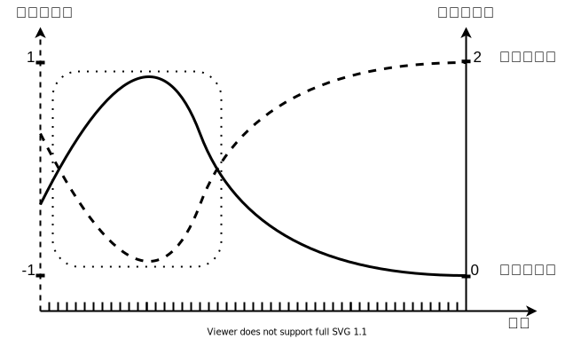
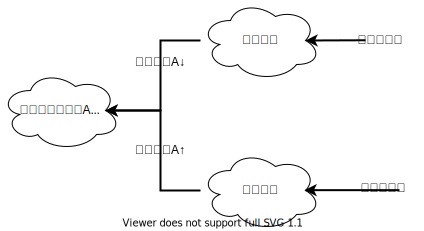

# Actor-Critic算法

迈克尔·乔丹作为NBA 史上最伟大的篮球运动员之一，其辉煌的职业生涯中最令人津津乐道的两场赛事，一是1997年6月11日NBA总决赛的第5场比赛，乔丹率领的公牛队对阵持续巅峰了十年的犹他爵士队，乔丹在最后1分钟那记决定胜负的三分球使得公牛队最终以90比88艰难取胜。另外一场发生在1998年6月14日，还是公牛对战爵士，在比赛时间只有30秒的时候，爵士队以86比83领先。乔丹先是上篮得手，将差距缩小到1分，在最后5.2秒时打进了关键球，使得公牛队再次捧起NBA冠军奖杯。乔丹一生进过无数个球，但是能被人们深刻记住的却只是这几次在比赛逆势下靠一己之力扭转乾坤的进球。这说明了在恶劣情况下做出的翻转局势的行为才具有非凡的价值，值得我们铭记。

在使用策略梯度进行学习的时候，很多学习的样例可能并不是最好的，甚至可以说是盲目的，僵化的。一局棋不可能每一步都是好的下法，对于赢棋一方落子的评价，只能说好的下法占据了特别有利的形势使得差的下法不能够对局势产生大的影响，对于输棋一方的着法其实也是一样的道理。我们希望智能AI能够多学习一点好的下法，少学习一点差的下法。AC算法就是在这种思想下诞生的。通过结合梯度策略与价值网络这两种结构，实现了对样本标签的效力判定。


就和乔丹那几场让人难以忘记的比赛一样，AC算法会鼓励智能体对于扭转局势的行动多学习一些，但是那些对局势没有什么影响的行为就少学习一些。使用AC算法学习的智能体需要两个网络，分别对应AC算法中的演员（策略网络）和评论家（价值网络）。策略网络负责根据当前棋局给出建议下法，而价值网络则负责对当前棋局对落子方是否有利进行判断。其中，策略网络和前章中的梯度策略里使用的网络概念没有什么区别。价值网络则稍微有些不同，这里的价值网络不再对落子点的预期价值进行评估，而是仅评估当前局面的胜负预期。换个角度来看，前章DQN中的价值网络是对落子后的胜负概率进行评价，而这里的价值网络是对落子前的胜负概率进行评价。我们人类有一种称作直觉的能力，通过这种能力，我们无需真的去演算一局棋剩下的所有可能走法，只需要看一眼棋局，就能够给出双方胜负大致的概率。AC算法中，我们希望智能体的神经网络也能够具备这种直觉，依靠这个直觉就能够帮助智能体更好地学习历史样本，从而更高效的提升策略网络的棋力。



在行棋的过程中，价值网络在每一步落子前对当前局势给出一个关于胜负的评估，告诉棋手当前局面是处于优势还是劣势。上图是一次对弈中，棋手转败为胜过程的记录。从图中的短跳线可以看出，一开始棋手的着法不是很好，使自己陷入了非常被动的局面。但随着对弈的发展，棋手逐渐扳回了劣势的局面并最后获得了胜利。与胜负预期相比，棋手每一手的价值却是反方向运动的。在胜负预期最差的情况下，棋手的着法却获得了最大的价值，这显然是合理的，因为在最差预期下能够扭转局面的着法一定是一步好棋。图中用点线框出的部分是最该被学习的部分，后面由于局面已定，并且棋手发挥稳定，每一步都只是维持住了优势的局面，所以可学习的东西就不多，价值也就逐渐趋向于零了。价值的公式可以用如下公式计算：

$$
R^r = R-R^p \\
其中，R^r表示每一步的价值\\
R表示棋局最终结果的价值\\
R^p表示价值网络对胜负的预期
$$

我们用表格复演一遍上面的公式，其中胜负预期在\(-1,1\)区间取值，赢棋的一方最终得到价值1，输棋的一方得到价值-1：

| 落子方 | 胜负预期 | 棋局最终结果 | 着法的价值 |
| :--- | :--- | :--- | :--- |
| 黑棋 | 0.5 | 1 | 0.5 |
| 白棋 | -0.4 | -1 | -0.6 |
| 黑棋 | -0.8 | 1 | 1.8 |
| 白棋 | 0.6 | -1 | -1.6 |
| 黑棋 | 0.9 | 1 | 0.1 |
| 白棋 | -0.8 | -1 | -0.2 |

在策略梯度中我们对胜利一方所有的着法都认为具有价值1，输棋一方的着法都认为是价值-1。这种武断的判断未免有失偏颇，虽然可以通过成千上万次的对弈正负抵消掉那些价值不高的着法，但是在效率上实在是不高。而AC算法通过引入对棋局的评价，使得我们能辨识出哪些着法是好的，哪些着法是差的，哪些着法又是无关紧要的。好的着法价值更高（超过了赢棋后获得的价值1），差点着法就价值更低（低于-1），无关紧要的着法价值就会趋近零，这样我们在训练策略网络时就更能有的放矢。

读者可能会意识到，在最初的时候价值网络并没有得到很好的训练，给出的胜负判断是随机的，根据随机的胜负预期得到的价值还有指导意义吗？应该这么说，AC算法是策略网络与价值网络一起在同步学习的，不仅仅是策略网络根据价值网络的指导在学习，策略网络同样也要根据棋局的结果来修正自己的判断能力。即使最开始策略网络对价值网络的学习指导可能存在误导，但是随着价值网络学习的越来约好，判断成功率越来越高，这些过去的错误是会被修正的，并且由于错误判断的胜负预期会导致着法价值远高于棋局价值1或者-1，所以修正的速度会相当快，读者无需担心。因此在训练使用AC算法的神经网络时没有必要预先训练价值网络，价值网络完全可以和策略网络一同训练。只是一开始大部分的样本是用来训练价值网络的，在价值网络没有稳定钱，策略网络一定会有很强烈的抖动，但是随着价值网络趋于稳定，策略网络就能逐渐逼近最优解。

AC网络能够在训练时还具备一定程度上的正则化功能。由于价值网络和策略网络所学习的样本标签具有不同的概率分布，当价值网络通过梯度下降法想调低参数A的时候，策略网络却想调高参数A，两者对参数的调整方向相反，具有抵消的效果，这样就从一定程度上避免了网络发生过拟合的现象。如果两个网络对A参数调增的方向一致，则会导致A参数调整过头，在下一次反向传播时根据实际情况算法会自动将A参数往反方向调整。



使用AC算法训练智能体的流程和之前介绍的策略梯度与DQN的流程大同小异，为了节约篇幅，就不再累述了。为了稍微凸显出一些区别，源码里我删掉了在对弈时保存棋谱的流程，直接把智能体互弈的过程并保存到HDF5文件中。另外AC算法的神经网络结构也和我们之前使用的略有不同，之前我们使用的网络都是单个网络的输出，AC网络需要有两个网络，并输出不同含义的预测值。


```python
def Model_AC(boardSize):
    input=keras.layers.Input(shape=(boardSize**2+1,))
    reshape=keras.layers.Reshape((boardSize,boardSize,1))(input[:,:-1])    #1
    feature=keras.layers.Conv2D(3**4, 2, strides=1, padding='same', 
        activation='tanh', kernel_initializer='random_uniform',
        bias_initializer='zeros')(reshape)
    ...
    lnk=keras.layers.concatenate([feature, 
        input[:,boardSize**2:boardSize**2+1]], axis=-1)
    actor=keras.layers.Dense(1024*4, 
        kernel_initializer='random_uniform',
        bias_initializer='zeros',activation='tanh')(lnk)
    ...
    actor_output=keras.layers.Dense(boardSize**2,
        activation='softmax')(actor)
    critic=keras.layers.Dense(1024*4, 
        kernel_initializer='random_uniform',
        bias_initializer='zeros',activation='tanh')(lnk)
    ...
    critic_ouput=keras.layers.Dense(1,activation='tanh')(actor)
    return keras.models.Model(inputs=input, 
        outputs=[actor_output,critic_ouput])    #2
```


1. 由于要使用卷积网络来提取棋盘的特征，而输入是平摊后棋盘数据，因此先将输入格式调整为高维度格式。读者也可以直接输入高纬度的棋盘数据；
2. 之前我们的网络都只有一个输出，AC网络需要分别输出策略和评价。Keras使用数组将多个网络的多个数组拼接在一起，作为AC网络的整体输出。

在使用Keras初始化网络学习的模式参数时，我们不再只有一个输出项目，因此在需要调整一下模型compile里的参数。我们的策略网络和策略梯度中一样使用交叉熵作为代价函数，而价值网络和DQN里的一样，采用均方误差作为代价函数。由于是不同的网络结构，策略网络和价值网络在输出误差（预测与标签的差异）上可能会存在数量级的差异，而这两个网络在梯度更新时，又会更新到公用的卷积网络部分，数量级的差距可能会导致一个网络无法更新，为了解决这个问题，我们加入梯度更新权值参数来平衡这两种网络在数量级上的差距。


```python
def compile_ac(self):
        self.model.compile(optimizer=keras.optimizers.SGD(learning_rate=0.001),
            loss=['categorical_crossentropy', 'mse'],    #1
            loss_weights=[1,.5],    #2
            metrics=['accuracy'])
```


1. 同时采用交叉熵和均方误差来作为代价函数。参数的顺序必须和网络的输出顺序一致，如果顺序有误，不会在程序运行时报错，但网络在实际表现上会和预期的行为差距很大；
2. 为两个网络的误差值增加权值比例，读者需要根据自己网络的实际情况来调整策略网络与价值网络的误差权值比例。

在智能体互弈时，策略网络的下棋方法和梯度策略中使用的是一样的，我们按照概率比例从策略中选择着法，训练过程也是和策略梯度的训练方法一样。价值网络在下棋的过程中不起作用，我们仅保存价值网络的输出值，以备后续训练时知道策略网络的学习时使用。价值网络的训练过程比较简单，我们输入棋局，并将输出与最终棋局的实际胜负做比较，利用均方误差做反向梯度计算。

前面的两种强化学习算法中我们只在HDF5里保存了棋局，着法以及胜负。在AC算法中，智能体的策略网络学习的标签不再是胜负获取的价值，而是胜负获取的价值减去智能体在下棋时对棋局胜负的预期。在AC算法中我们还需要再多保存对局胜负的预期。

```python
def save_ac(self,moves_his,result,h5file):    #1
    if result>0:
        winner=1
    elif result<0:
        winner=-1
    else:
        return
    h5file=HDF5(h5file,mode='a')
    grpName=hashlib.new('md5',
        str(moves_his).encode(encoding='utf-8')).hexdigest()    #2
    h5file.add_group(grpName)
    h5file.set_grp_attrs(grpName,'winner',winner)    #3
    h5file.set_grp_attrs(grpName,'size',self.board.size)    #3
    for i,dset in enumerate(moves_his):
        h5file.add_dataset(grpName,str(i),dset[0])    #4
        h5file.set_dset_attrs(grpName,str(i),'player',dset[1])    #4
        h5file.set_dset_attrs(grpName,str(i),'target',dset[2])    #4
        h5file.set_dset_attrs(grpName,str(i),'value',dset[3])    #4
```

1. 由于在AC算法的演示里我们没有保存棋谱，HDF5里的样本直接来源于棋局，因此需要输入一局棋的全部着法；
2. 我们给每局棋做MD5签名，并用这个签名作为棋局的名字，这样做的好处是可以防止重复记录一模一样的棋局；
3. HDF5的group里设置赢棋方和棋盘的尺寸；
4. 具体每一回合保存棋盘、落子方，着法和对输赢的预期。

AC算法本质上还是策略梯度的方法，只是优化了其学习时的效率，可能在训练回合数不多的情况下其表现会优于策略梯度，但是如果双方都训练了足够多的样本，在表现上应该是不分伯仲的，或者说是差不多的。但是不管是用策略梯度也好，DQN或者AC算法也好，由于围棋游戏的复杂度实在是太高，网络拟合的能力受限于其网络结构以及我们的计算机算能，所以即使用了强化学习，智能体棋力的提升也是有限的。后面章节我将介绍AlphaGo和AlphaZero使用到的方法，这两种方法都是将蒙特卡洛搜索树方法与强化学习相结合。AlphaGo击败了9段李世石，而AlphaZero则轻易地击败了AlphaGo。

