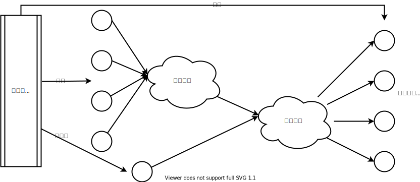
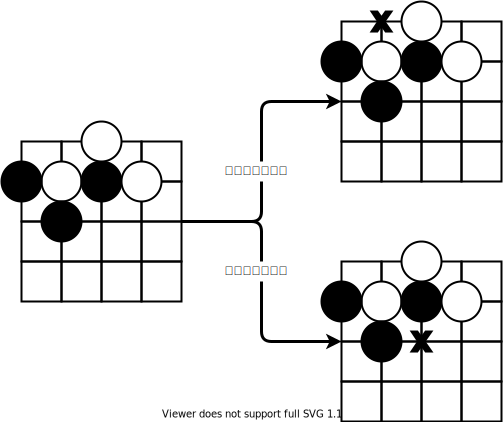

# 第五章 第一个围棋智能体

## 围棋棋谱

棋谱是一盘棋局对弈发展的过程纪录，是用图和文字记述棋局的基本技术和开局、中局、残局着法的书和图谱，按所记述的棋局排演，可参考吸收其着法，或探讨研究名手的棋艺风格。不同的棋戏会有不同的棋谱，按棋种分中国象棋棋谱、国际象棋谱、围棋棋谱、五子棋棋谱等。


围棋谱是围棋对弈过程的记录，在纸上画上棋盘，并在黑、白棋双方落子的位置上注明该手手数。围棋的传播和发展，离不开棋谱的编撰和出版。我国围棋谱的产生年代，据现有文献资料，还不能推到汉朝以前。《敦煌棋经》指出：汉朝时有《汉图十三势》；三国时有《吴图二十四》，这两本围棋谱大概算得上是我国最古的棋谱了。到了晋朝，有棋圣之称的马绥明等人撰写了《围棋势》29卷，这是我国古代卷数最多的一套围棋谱。这些编撰成集、经过校定的围棋谱，无疑都是当时名棋手对局中的精华。它们的流传，对围棋的发展起了不可低估的作用。遗憾的是，这些宝贵的棋谱后来全部失传。但值得庆幸的是，在现今，我们可以将棋谱保存为电子档格式以供软件阅读和人们打谱。其中，SGF和PGN是两种最常见的棋谱电子档格式。国际象棋以PGN作为记录棋谱的标准规范。网络围棋使用SGF格式作为记录围棋棋局的格式，绝大多数围棋软件都在使用它。SGF和PGN不是专门为某一种棋类设计的棋谱格式，它们最初设计的目的都是为了可以记录所有棋类游戏的棋谱，所以用SGF格式记录国际象棋的棋谱和用PGN格式记录围棋的棋谱都是可行的。 目前最通用的围棋棋谱格式是SGF格式，我们这里选择使用这种格式来保存围棋棋谱。额外说一句题外话，中国象棋的电子棋谱采用什么格式保存目前还没有统一的标准，由于PGN在国际象棋棋谱上的地位，采用PGN格式来记录中国象棋会是一个好的选择。

SGF文件是由一组属性和属性对应的值组成的。它存储的内容是纯文本，可以移植到不同的平台，并且短小精悍。下面的这串文本就记录了一个完整的SGF格式文件。

$$
(;FF[4]GM[1]RE[W+26.5]SZ[19];B[pd];W[dd])
$$

读者可以使用任何支持SGF格式文件的围棋软件打开它。这个仅41个字符的文本就是一张棋谱，为了演示方便，它只有2手，在Sabaki里显示如下：


SGF文件记录整张棋谱时以左括号开始，以右括号结束，每个信息段落以分号开头。棋局的基本信息必须记录在SGF文件的第一个段落里，一般把它看作是文件头。关于棋局的信息记录在后续的段落是无效的。双方每一步落子都是一个独立的段落。记录的属性用大写英文字母表示，属性对应的值紧跟在属性之后，用一组方括号提示。下表列出了常见的属性，对于设计一款围棋智能软件，这些信息已经足够了。读者如果想要了解更多详细的内容可以参考[这里](https://www.red-bean.com/sgf/user_guide/index.html)的介绍。

| 属性 | 定义 |
| :---: | :--- |
| GM | 游戏种类，1代表围棋 |
| RE | 比赛结果，\[W+26.5\]表示白棋胜26.5目 |
| SZ | 棋盘尺寸大小 |
| FF | SGF采用的版本，目前第四版是最新版本 |
| HA | 表示让子数，0表示分先 |
| KM | 表示贴多少目 |
| B | 黑棋落子，\[pd\]表示右上角星位 |
| W | 白棋落子，\[dd\]表示左上角星位 |

SGF的棋盘坐标与我们常见的很不一样，它以棋盘的左上角为原点，横轴和纵轴均由字母a开始逐个往后排，直到s（19路棋盘）结束。在记录落子方位时，先数横轴再数纵轴。


用Python语言操作SGF文件可以使用现成的库，还是那句话，我们要尽量避免重复造轮子，努力站在巨人的肩膀上。Gomill是一个非常优秀的SGF文件操作库，唯一的遗憾是它只支持Python 2.x，而Python 2.x的支持在2020年就结束了，目前作者Matthew Woodcraft似乎也没有将它移植到Python 3.x的意愿。所幸作者还提供了一个功能简化版的sgfmill库，这个库可以在Python 3.x上使用，而且工作的相当好。对我们读写SGF文件来说sgfmill已经足够了。我们通过gomill或者sgfmill为sgf文件生成一个文档结构图，引入文档结构图的概念使得操作sgf文件和操作xml文件一样简单方便。

## HDF5文件结构

HDF5格式的文件是一种常见的跨平台数据储存文件，是存储和组织大量数据的一组文件格式，它常被用来存储不同类型的图像和数码数据。由于机器学习需要使用大量的数据，HDF5文件是存放训练样本和标签的一个非常好的选择。

HDF5的文件结构非常简单， 文件中的资源采用类似POSIX语法的“/路径/至/资源”来访问。它包含两种主要的对象类型，数据集（dataset）和群组（group）。 群组类似于文件夹，每个HDF5文件其实就是文件夹的根目录。而数据集则类似于Numpy中的数组。数据集除了存放数据本身，还可以为数据增加额外的属性值。比如，在DHF5文件中存放了一张图片，如果我想为这个图片数据额外增加图片内容的描述，便可以为这张图片增加一个图片描述的属性。属性本身没有个数限制，可以根据应用场景的实际需要进行添加。Python中可以使用h5py这个库来处理HDF5格式的文件。

本书本书使用HDF5格式文件来保存棋局中的每一个棋面情况。HDF5的结构采用扁平化的方式，即每一局棋保存为一个单独的群组，一局棋的每一个棋面情况均保存为一个单独的数据集。假设一局棋黑棋执先，在第70手的时候白棋投子认输，那么这局棋将会单独保存为一个群组（group），并且这个群组下会有70个数据集（dataset）。如果将1000局棋局保存到一个HDF5文件中，那么这个HDF5文件里就会有1000个并列的群组。


我们以上图6\*6的棋盘为例。棋盘可以用一个二维的6\*6的矩阵表示，空棋盘用数字0表示，黑棋棋子用1表示，白棋棋子用-1来表示。输入棋盘可以表示为矩阵：

$$
样本棋盘： \left[
 \begin{matrix}
0 & 0 & 0 & 0 & 0 & 0 \\
0 & 0 & 0 & 0 & -1 & 0 \\
0 & 0 & 1 & 0 & 0 & 0 \\
0 & 0 & 0 & 0 & 1 & 0 \\
0 & 0 & 0 & 0 & 0 & 0 \\
0 & 0 & 0 & 0 & 0 & 0
  \end{matrix}
  \right]
$$

对于输出标签来说，我们没有用1和-1来表示黑棋和白棋，而是仅用数字1来标注落子的位置，并把当前落子方的颜色信息保存到HDF5数据集的属性里。读者如果采用1和-1这种方式来标注落子位置也没有问题。

$$
落子标签：  \left[
 \begin{matrix}
0 & 0 & 0 & 0 & 0 & 0 \\
0 & 0 & 0 & 0 & 0 & 0 \\
0 & 0 &0 & 0 & 0 & 0 \\
0 & 0 & 1 & 0 & 0 & 0 \\
0 & 0 & 0 & 0 & 0 & 0 \\
0 & 0 & 0 & 0 & 0 & 0
  \end{matrix}
  \right]
$$

神经网络的训练过程需要将HD5文件中的样本解析出来。数据集中的棋盘局面可以直接提取后直接输入卷积网络进行特征提取。从属性中取出样本标签用于神经网络的损失计算和反向传播。落子方信息从属性中提取后不用参与棋盘局面的特征提取，而是在之后的逻辑判断中再进行输入。




我们借鉴著名的inception网络来构建我们的围棋智能模型。Inception是深度网络，它采用深度网络。。。。我们不打算使用像inception那么深的网络，这里我们只借鉴Inception的一组模块用于棋盘的棋形识别，然后还是和之前的感知网络一样，我们使用全连接层来做逻辑判断。为了平滑地从卷积网络过渡到感知网络，我们使最后一层卷积的输出是一个1\_1\_c的形状，然后再使用flatten功能把这层展开为感知网络。

在机器学习中，样本常常不能一次性获取全部完整的样本，它总是一点一点积累的。在围棋训练样本这件事情上也是一样，我们总是得到一些棋谱就希望拿来作为训练样本，等有新的赛事结束后再把新的棋谱拿来做新的样本。每次获取到新的样本集后我们都可以为其独立生成一个HDF5文件，而不用每次都全量重新生成一个单独的HDF5文件。在训练时，每次都从文件系统上随机抽取HDF5文件会增加磁盘IO的开销。由于我们的HDF5文件结构非常简单，从理论上看，只要保证group名不重复，把新增的HDF5文件合并到原来的HDF5文件上是完全可行的。技术上，[hdf5官方套件](https://www.hdfgroup.org/solutions/hdf5/)提供了一个叫做h5copy的命令行工具，但在使用它之前，需要下载完整的HDF5应用程序，Windows用户可以在官网上直接下载。

n仅指最近的下一层节点访问的次数。由于落子的顺序不同，会存在上一层不同的棋形共享下一层的情况，因此N&lt;=n。为了辨识出共享棋形的子节点，我们用佐布里斯特散列来标识唯一的棋形，也就是节点。


alphagozero的网络在结构上和ac网络类似，差异仅仅在于学习方式上的不同

如何判定算法已经找到了最优解？我的AI程序已经训练一千万次了，没有人类选手能够击败它了，是不是意味着我的AI程序已经找到了围棋的最佳拟合函数呢？围棋本身可能并不是一款零和游戏，不过人们根据长久的围棋游戏经验，规定了在游戏结算时进行贴目，这样可以使得原本不是零和的游戏成为零和游戏。但是贴多少目才能保证游戏的公平性一直没有定论。假使有一款围棋AI已经能够以无限接近的方式拟合了围棋游戏的函数F\(x\)，通过让这款AI进行互弈，将胜利方多出的目数贴给失败方，我们就能解决贴多少目是公平的这个问题。确定AI是否已经最佳拟合了围棋的函数F\(x\)也很简单，通过反复的互弈，如果每次胜利方都是先手并且获胜的目数是固定的，那么我们就可以认为AI已经最佳拟合围棋的函数F\(x\)。所以如果现在没有一款AI程序可以做到这一点，那么围棋AI的算法就还需要改进，人类肯定已经不是挑战的目标了，现在已经变成了机器智能间的竞争。


在编写价值网络的时候，棋盘编码可以有两种，其实现难度也不同。一种是比较直观的方法，棋盘的棋形输入和落子着法分开，我们把他们看作是两件事。这种编码方式下，我们使用卷积网络提取当前棋盘局势的特征，然后再合并落子的着法，将它们输入逻辑网络进行判断，得出当前着法在当前棋局局面下的价值。另外一种方法略微抽象，我们把当前落子着法看成是棋盘的一项特征值，将其合并到已有的特征中去，形成新的一个图层，接着只需要将手工编辑好的特征输入卷积网络，我们就可以直接得到着法对应棋面的价值了。后一种方式不仅在编码实现上更简单，而且网络结构的复杂度也比前一种更低。本书对应的源码采用了前一种方法。这么做的目的是为了展示如何使用Keras来拼接网络。由于Keras的文档对这方面的介绍很少，我希望能够给读者从另外一种视角拓展对Keras在实际应用上的认识。

## 数据模型

要用神经网络来学习围棋，首先要将围棋数字话。本书代码中的样例中用数字1代表黑棋，-1代表白棋。棋盘上的空子用0表示。5路棋盘就用一个（5，5）的数组来表示。


除了有棋盘的局面，如果需要神经网络给出落子建议，我们还需要告诉神经网络当前是轮到谁落子，显然同一局面，不同的落子方会导致有不同的选择。



一种通知神经网络哪方落子的方法是为神经网络增加一个输入，用1和-1来分表表示应该是黑棋还是白棋落子。

通常为了神经网络在结构上表达能够尽量简洁，我们习惯只为网络设置单一的输入接口，


考虑到棋盘局面是一个二维数据，如果我们用卷积网络来收集图形特征的信息，可以考虑为卷积网络的输入再多增加一个通道，用这个通道的数据来表示当前应当是黑棋还是白棋落子。这种方法好处是实现上要比上一种方法简单，缺点是必须要使用卷积网络，但是考虑到围棋棋盘采用卷积网络能获取到更好的图形特征，所以对于围棋而言这并不算是一个缺点。


本书的代码样例中上述两种方法都有使用，本章采用第一种方式，即通过卷积网络提取棋盘局面的特征，而后将盘面特征再结合当前落子方输入到逻辑判断网络进行最后的落子选择。

## 获取训练样本

u-go.net是一个围棋爱好者的网站，我们能从上面免费下载到[K Go Server](http://www.gokgs.com/)（KGS）网站上棋手的对战记录。这些对战记录都被保存为SGF格式文件。网站提供了[7段以上](https://u-go.net/gamerecords/)或[4段以上](https://u-go.net/gamerecords-4d/)棋手的对弈记录。通常为了保证机器学习后的下棋棋力，可以采用7段以上的对弈棋谱，如果样本偏少的话，再考虑使用4段以上的棋谱。为了保证学习的质量，我们可以只采用单局胜利方的落子法作为样本标签。网站上还提供了其它一些可以下载到专业级选手的下棋棋谱的[链接](https://www.u-go.net/links/gamerecords/)，但是其中大部分是收费的。

围棋棋盘本身是没有方向性的，比如开局时第一个子落在哪个星位对对手而言并没有什么区别。但是对于计算机而言，它自身并没有人类那种能自适应的能力，特别是我们通过卷积网络来提取特征值时，网络对物体特征的位置或者方向是很敏感的。图像识别的人工智能训练中有一种称作数据增强的技术，方式是通过旋转或者翻转原始样本来增加神经网络训练时的样本集，使得神经网络在训练后能够识别倒转的或者不同角度的目标物体。在训练围棋智能体的时候，为了提高训练的效率，我们也采用类似的技术。由于围棋棋盘总是一个四方形，在获取一个训练样本后，我们可以对样本进行90度，180度，270的旋转，同时还可以对样本进行水平进行，并再次进行旋转。这样，一个样本通过这种技术处理后，就变成了8个样本。


由于人工棋谱的数量相对于机器学习所需要的数量来说还是相对偏少的，通过上述技术可以缓解这个问题，但是要从根本上解决，必须要将样本生成的过程变成自动化。最方便的产生棋谱的方式是使用现有的围棋智能程序来相互对弈，通过这种方式我们可以产生源源不断的围棋棋谱。但是这种方式有一个致命的缺点，就是被训练的智能程序在棋力上很难突破原有的智能系统。这个致命缺点也是传统的以监督学习为核心算法的人工智能的一个通病。在后面的章节中我们将看到其它更加有效的方法来增强围棋智能体的训练结果，不过目前而言，通过这种传统方法，我们的围棋智能体在棋力上已经能够胜过随机落子的系统了。

## 代码演示

传统的神经网络通过监督学习来更新其中的参数信息，本质上就是通过拟合训练集中的数据，从而建立一个预测函数，并依靠这个函数对新的数据推测出新的结果。其中，训练资料是由输入样本和预期输出的标签所组成。而函数的输出可以是一个连续的数值或是预测一个分类。简单地来看，围棋游戏可以抽象为人工智能研究领域的分类问题。19路棋盘的361个落子位就是361种分类。这一节中我们利用前面的知识并结合神经网络来具体实现一个智能体，它可以根据棋面的不同局势判定当前棋局应该归类为361个分类中的哪一个，从而给出落子建议。


```python
filePath="./game_recorders/game_recorders.h5"                #1
games=HDF5(filePath,mode='r')                #2
type='pd_dense'                #3
model=DenseModel(dataGenerator=games.yeilds_data,
                boardSize=9,dataSize=1024*100,model=type)                #4
```


1. 学习样本的数据存放在HDF5的格式文件中。训练样本可以从历史棋局中获取，也可以通过程序来自动生成，如何通过程序来自动生成棋谱将在通用化围棋AI程序中进行介绍；
2. 通过games来实现从存储样本的HDF5文件中获取训练样本和对应的标签；
3. 我们在DenseModel中预定义了网络模型，pd\_dense类型包含了是一个可选的参数用来指定是使用全连接网络还是卷积网络，默认是卷积网络。type也可以直接设定为cnn，从而显示地指出使用卷积网络；
4. 调用预定义的DenseModel神经模型。使用games中的数据发生器来产生源源不断的训练数据。数据发生器是一项非常好用的技术，特别是对于样本数据量巨大的训练过程，系统由于内存限制，不可能一次性载入全部数据，通过这项继续，训练过程可以逐个按需获取训练样本。附录《Keras入门指南》中有对这项技术的详细介绍。


```python
model.model_compile()    #1
model.model_fit(batch_size=16*2,epochs=10000,earlystop=10,checkpoint=True)    #2
model.model_save(type+'.h5')    #3
```


1. 使用DenseModel预定义好的梯度优化算法和误差函数；
2. 开始训练，这里使用了早停和记录网络参数的功能。由于我们训练回合过多，对训练效果也不清楚，所以使用早停和参数记录避免由于网络设计不合理导致的训练时间浪费；
3. 训练完成后保存模型。

使用Keras来做传统的神经网络训练十分的方便，代码写作方式也基本固定，我们仅需要在参数选择上进行调整。我们可以使用`myGO/test_fast_play.py`来看一下使用这种训练方法的棋力。


```python
from board_fast import * #1

board = Board(size=9)
bot1=None    #1
bot2=Robot(ai='SD',boardSize=9,model='pd_dense')    #2
game=Game(board)
print(game.run(play_b=bot1,play_w=bot2,isprint=True))    #3
```


1. 引入board\_fast工具下的所有方法方便后续调用；
2. bot1设置手工输入，bot2采用我们刚刚训练好的模型。Robot方法默认装载入`myGO/`下的`lj.h5`神经网络权重文件，所以在使用训练结果时要记得手工调整一下训练结果文件的文件名；
3. 调用起棋局，并打印出胜负结果。

