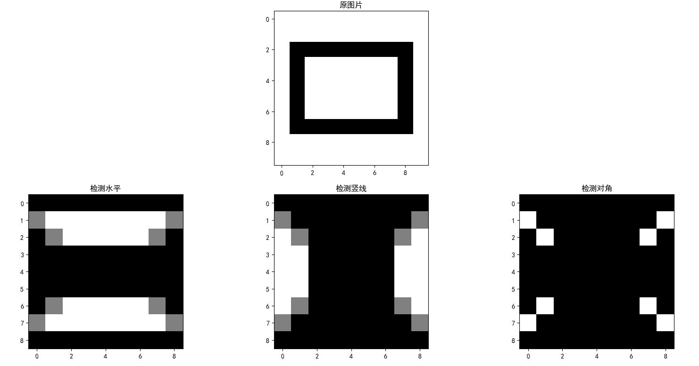
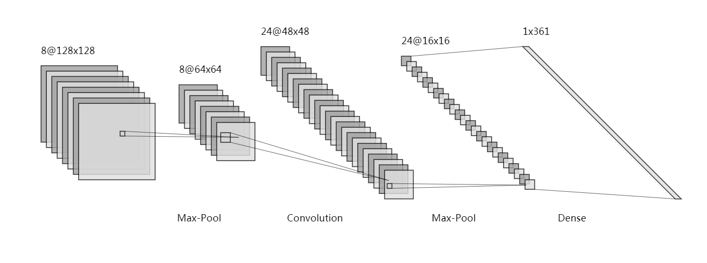
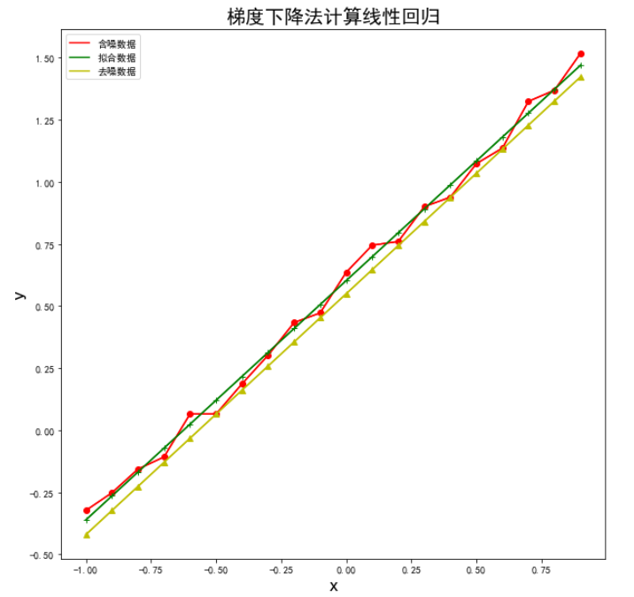
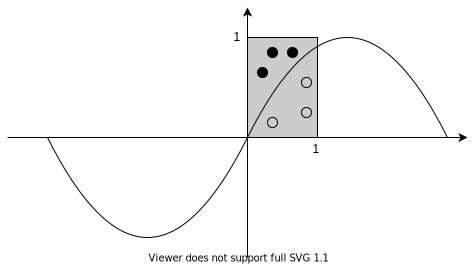
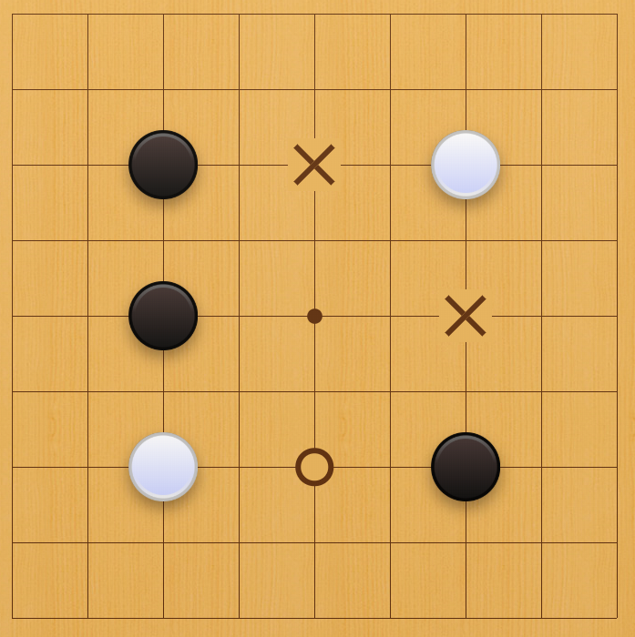
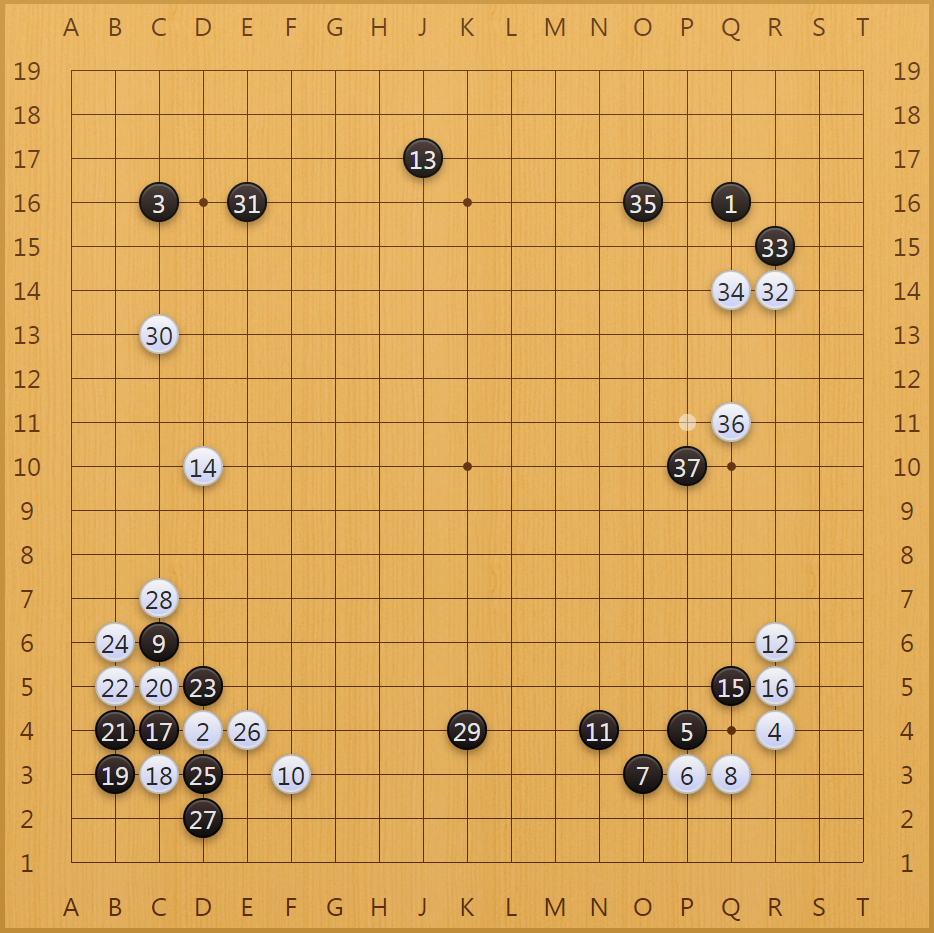

# 第四章 机器学习入门

人工智能简称AI，它表示由人类制造出来的机器所表现出来的智能。现阶段人工智能是指通过普通计算机程序来呈现人类智能的技术。人工智能的核心问题包括建构能够跟人类似甚至超卓的推理、知识、规划、学习、交流、感知、移物、使用工具和操控机械的能力。机器学习是人工智能的一个分支，是一类从数据中自动分析获得规律，并利用规律对未知数据进行预测的算法。它是人工智能的核心，是实现人工智能的一个途径。机器学习又可以分为监督学习、无监督学习和强化学习。其中无监督学习针对没有给定事先标记过的训练示例，自动对输入的数据进行分类或分群。这种方式主要是应对那些人类缺乏足够的先验知识的问题，这类问题要么难以人工标注类别，要么进行人工类别标注的成本太高。很自然地，我们希望计算机能代我们完成这些工作，或至少提供一些帮助。根据现有的知识来看，这个领域暂时对我们设计围棋智能程序帮助不大，限于篇幅就不对这个领域进行介绍了。强化学习作为实现围棋智能程序超越人类的核心算法，将单独开立章节论述。监督学习的方法有许多，我不愿意逐一例举以充篇幅，本章将着重介绍目前最优前途的方法----人工神经网络，而其它方法也和无监督学习一样留给其他人吧。

## 人工神经网络

当前红火的人工神经网络并不是一个新的概念，它最初受到中枢神经系统的启发，在人工神经网络中把每个人工节点称作神经元，并将这些神经元连接在一起，形成一个类似生物神经网络的网状结构。二十世纪40年代后期，心理学家唐纳德·赫布根据神经可塑性的机制创造了一种对学习的假说，现在称作赫布型学习。1954年法利和韦斯利·A·克拉克首次使用计算机模拟了一个赫布网络。1956年纳撒尼尔·罗切斯特在一台IBM 704计算机上模拟了抽象神经网络的行为。之后弗兰克·罗森布拉特基于抽象神经网络创造了感知机，就是目前我们熟知的全连接网络。1969年马文·明斯基和西摩尔·派普特发表了一项关于机器学习的研究以后，神经网络的研究就停滞不前了。主要原因是他们发现了神经网络的两个关键问题。第一是基本感知机无法处理异或回路。第二个重要的问题是电脑没有足够的能力来处理大型神经网络所需要的很长的计算时间。1975年，保罗·韦伯斯发明了反向传播算法，这个算法有效地解决了异或的问题。第二个问题依赖于技术的进步，这也是为什么直到2006年之后，这项技术才又重回人们的视野。

人工神经网络的连接方式目前还没有统一的方式，在软件实现上，其实原先受到生物学启发的那些方法已经很大程度上被抛弃了，取而代之的是基于统计学和信号处理等学科中发明的更加实用的方法。如今最常见的一些神经网络，例如卷积神经网络和循环神经网络，基本上和生物的神经系统已经没有什么相似之处了。典型的人工神经网络由三部分组成，网络结构、激励函数和学习规则。神经元是神经网络中最基础的组件，多个神经元的拓扑关系构成了神经网络的模型。大部分神经网络模型具有一个动力学规则，这个规则定义了神经元如何根据其它神经元的活动来改变自己的输出值，人工神经元采用预定义的激励函数来计算这个激励值，它的计算依赖于网络中各个网络参数的权重。需要注意一点，为每个神经元单独定义激励函数在目前的技术条件下是没有意义的，因为没有证据表明哪种激励函数比其它激励函数更加优越。学习规则定义了网络中各个神经元上的参数权重如何随着学习进度而进行调整。

### 神经元

 神经元是人工神经系统中最基本的结构和功能单位。每一个神经元上的连接都有各自的权重。这个权重可以是负值，正值，非常小，或者非常大，也可以是零。和这个神经元连接的所有神经元的值都会乘以各自对应的权重。然后，把这些值都求和。在这个基础上，会额外加上一个偏置，这个偏置也是一个数字，有些时候是一个常量（经常是-1或者1），有些时候会有所变化。这个总和最终被输入到一个激活函数，这个激活函数的输出最终就成为这个神经元的输出。


图中，a1~an是神经元的输入分量，w1~wn为神经元各个突触的权值，b为神经元的偏置，f是这个神经元的激活函数，通常是一个非线性函数。t为神经元的输出。抽象后的数学模型可以写作： 

$$
t=f(\vec{W}'\vec{a}+b)
$$

其中 $$\vec{W}$$是神经元的突触权重向量， $$\vec{W}'$$是其转置， $$\vec{a}$$是输入向量。

一个神经元的功能是求得输入向量与权向量的内积后，经一个非线性传递函数得到一个标量结果。而单个神经元的作用就是把一个n维向量空间用一个超平面分割成两部分。给定一个输入向量 $$\vec{p}$$ ，神经元可以判断出这个向量位于超平面的哪一边。超平面的数学表达式为：

$$
\vec{W}'\vec{p}+b=0
$$

### 多层感知器


通常来说，一个人工神经元网络是由一个多层神经元结构组成，每一层神经元拥有输入和输出，每一层是由多个网络神经元组成，下一层的每个网络神经元把对应上一层的全部神经元的输出做为它的输入，我们把神经元和与之对应的神经元之间的连线用生物学的名称，叫做突触。在数学模型中每个突触有一个加权数值，我们称做权重。多层感知器是采用这种结构的人工神经网络，它映射一组输入向量到一组输出向量。多层感知器可以被看作是一个有向图，由多个的节点层所组成，每一层都全连接到下一层。除了输入节点，每个节点都是一个带有非线性激活函数的神经元。我们利用被称为反向传播算法的监督学习方法来训练多层感知器。多层感知器遵循人类神经系统原理，学习并进行数据预测。它首先学习，然后使用权重存储数据，并使用算法来调整权重并减少训练过程中的偏差，即实际值和预测值之间的误差。它的主要优势在于其快速解决复杂问题的能力。多层感知的基本结构由三层组成：第一输入层，中间隐藏层和最后输出层，输入元素和权重的乘积被传递给具有神经元偏差的求和结点,主要优势在于其快速解决复杂问题的能力。多层感知器也被称作全连接网络或者前馈神经网络，这些术语被经常交叉混用。

### 卷积神经网络

火影忍者里漩涡鸣人的老师旗木卡卡西由于历史原因拥有一只写轮眼，写轮眼的瞳孔与普通眼睛不同，导致他为了隐藏这只眼睛，一直半边脸绑着绷带。我们知道，忍者都是易容术高手，但是不管怎么改变服装外貌，眼睛的瞳孔是没有办法改变的（带美瞳除外），不然卡卡西也就不用整天绑着绷带装酷了。如果在火影的世界有基于照相机的二维人脸识别系统，要识别伪装后的卡卡西老师，就需要能够检测出他的眼睛与别人不同。


理论上，我们需要这个人脸识别系统首先要能识别出人，而人的特征就是得有两只眼睛，一个鼻子，一张嘴这些最基本的特征。由于我们需要识别的是卡卡西，而他的特征在眼睛的瞳孔上，所以我们还要这个系统在识别出人的眼睛后，能够继续识别眼睛的细节特征并区分出写轮眼和普通眼睛。宇智波佐助也有写轮眼，如果单单只以写轮眼来辨识卡卡西显然是不够的，所以我们还需要系统能够进行逻辑判断，只有一个写轮眼的人是卡卡西，有两个的可能是佐助或者是其他什么人。之前介绍的全连接神经网络虽然也能够用来实现这个系统，但是根据之前的实验，即便是简单的手写数字识别，它的精度也是极低的，主要原因就是图片是二维的，全连接网络需要将二维图片展开成一维后才能处理，这步展开的动作损失掉了重要的空间信息。这一节要介绍的卷积神经网络它和全连接网络的最大区别就是它是基于被识别对象的空间特征而设计的，卷积网络（CNN）可以看作是全连接网络的拓展，在满足一定的条件下，卷积网络可以退化成全连接网络。在主流的应用中，卷积神经网络常用来提取被检测对象的空间特征，而全连接网络则用来做逻辑判断。

全连接网络的输入是一串一维的数据，而卷积网络则直接将高维度数据作为输入，比如处理图片就直接输入二维的图像数据。这个时候输入连接的就不是单个神经元了，而是一种称作为卷积核的算子。卷积核的数据形状一般小于被处理图片的形状，而且总是等边的。比如图像的尺寸是32_32，卷积核一般会使用2_2、3_3或者4_4的形状。和而且和全连接网络不同，卷积核之间的连接不再是交叉互联，而是每一层的卷积核只和上一层自己相关的父卷积核相连。


卷积的计算过程非常简单，分成两个过程。首先是矩阵的内积乘法，用卷积核在被处理的图像内抽取与卷积核相同尺寸的数据进行内积。第二步就是把这些内积值进行相加得到一个值作为卷积的结果。一般内积时，卷积核按照从左至右，从上到下的顺序从图像中取值和计算。卷积核在图像内滑动，就涉及到一个参数，我们称之为“滑动步长”。滑动步长是指卷积核每次内积前在图像内滑动的距离，大部分情况下这个步长会取值为1，以最大限度地保留信息。


假使有一张3_3的迷你图片，我们尝试用2_2的卷积核来对它进行卷积。演示采用滑动步长等于1。卷积核的尺寸为2_2，所以我们的图片取值窗口也设置为2_2的大小。首先利用取值窗口取出迷你图片左上角2_2的数据与卷积核做内积，完成第一步后再对2_2的内积结果进行求和操作从而得到单次操作的标量值。由于滑动步长为1，下次取值操作时取数窗口向右移1格，然后重复刚才的内积与求和的操作。两次卷积操作后，取值窗口到达了图片的最右端，下一次操作需要向下发展，由于滑动步长为1，取值窗口向下移动一行，并回到最左边开始取值。四次操作后，取值窗口到达了图片的右下角，一次完整的卷积操作结束。


众所周知，肉眼看到的彩色世界是由红、绿和蓝三种基本颜色所构成的，这三种颜色无法再进行分解，我们称它们为光学三原色。计算机在为彩色图片编码时采用的就是三原色叠加原理。一张普通的彩色32\*32大小的图片，实际上是由三组代表红、绿、蓝的32\*32数据构成的。将32\*32大小的图片数组化后，得到的是一个32\*32\*3的数组。在神经网络的计算机编码术语中，分别用字母w、h和c来分别表示图片的宽、高和通道。通道就是三原色基础颜色个数的一种专业称呼。如果我们删除了三原色中的红色，那么通道个数就变成了2。当我们处理的不再是图像数据时，通道的概念就可以引申为一些其它的抽象概念。比如对于围棋游戏，我有一个19\*19的数组来表示标准棋盘上的落子情况，我再额外引入一个全为1的19\*19大小的数组来表示黑方落子，当我把这两个数组拼接成一个19\*19\*2的数组时，就可以表示“当前棋局轮到黑方落子”这样一个概念。引入通道概念的二维卷积看似好像处理的是三维数据，但通道维度是由于计算机编码的需要而额外引入的，它对我们要处理的对象维度并不会产生影响。当我们要对32\*32\*3的彩色图像做卷积时，原来2\*2的卷积核也要相应地调整为2\*2\*3，并按照之前一样的顺序从左至右，从上到下进行计算。需要注意一点，求和的时候也是对全维度进行求和，也就是32\*32\*3的图像在经过2\*2\*3的卷积核卷积后，结果尺寸是31\*31，不再包含通道信息。如果我们用两个2\*2\*3的卷积核去卷积这个图像后，得到的就是两个31\*31数组，我们把卷积核的个数看作是卷积操作后产生的新数据的通道数。


可以发现图片经过一次卷积操作后，尺寸发生了变化。如果要防止卷积后的尺寸变小，一种显而易见的方法就是当卷积核在边缘卷积时，将卷积核移出去一部分到原始图像的外面。图像外部由于没有数据，我们可以把扩张出的图像值设置为0。这种操作一般称作零填充。当然，将边缘值直接向外复制也是可以的，具体填充什么值还是要根据实际应用来确定。


在神经网络没有流行起来，采用核函数来做图像处理就已经很普遍了，比如利用边缘检测来识别楼房。但是以前的核函数大多都是手工编辑的，带有主观性，比如下面三个卷积核就常被用来检测横线，竖线与斜线。 \[-1,-1\] \[1,-1\] \[1,-1\] \[1,1\] \[1,-1\] \[-1,1\] 代码xxx.py将一张图片分别用这四种卷积核来进行处理，为了方便演示，我将图像转成了灰度图，因为灰度图只有一个通道。经过卷积操作后，不同的卷积核检测出了不同的内容。通过组合不同卷积核检测出的特征，我们就可以识别更加复杂的对象。显然卷积后的内容其实也可以看作是一幅图片，因此可以对再后续继续进行卷积，从而识别出更加复杂的特征。



彩色图像为了表现细节，一样东西会有好多种色阶，比如为了表现自然光线下的头发，头发的颜色一定是由浅入深的。而我们识别图像时，希望捕捉到关键的细节，这种由浅入深的过程会使得识别出太多的特征，仅以头发而言，这种特征是不需要的。为了获得关键信息，人们通常会在卷积之后加入一种称作池化的操作，这个名字是直接翻译自英文单词’pool’，pool做名词时是水塘、泳池的意思，但是作为动词时它则表示集中资源，不知道为什么中文翻译要用名词的含义，直接看中文是完全不能知道是怎么回事的，但是为了随大流，我们这里还是使用池化这个称呼。池化操作比较简单，具体来说池化就是选则一定大小的窗口，在图像里移动这个窗口并取值，然后通过某个函数通过窗口输入的数据输出一个标量值，常见可以是取极值或者平均值。


通常在用卷积网络做图像识别时，利用卷积核和池化的组合就足够了。使用池化的主要目的是因为普通图片里有太多的冗余信息，利用卷积核的滑动步长来剔除冗余信息的同时也有可能抛弃了有用的信息，而池化过程是提取了图片中的主要信息，在提取效率上要更高一些。在用卷积网络处理围棋时，我们把棋盘看作是一张图片，而图片中的数据就是棋子的颜色。在对标准19路棋盘进行卷积网络时，我们可以把它看作是一个19\*19\*1的图片，图片里的数据由-1,0和1构成。其中-1表示白棋，0表示空的点位，而1就表示黑棋。由于围棋棋盘上的每个子都是重要的，所以一般我们在处理棋盘数据时不会使用池化网络，即便是使用池化，也只应该使用类似平均池化的方法，以判断池化窗口尺寸范围内双方棋子的多寡。

卷积过程和池化过程都会缩小上一层数据的尺寸。为了方便未来使用编程语言编程（比如Pytorch），我们需要利用尺寸变化公式来计算下一层数据的尺寸。我们架设图像是等边，经过一次卷积后的数据尺寸N为：

$$
N=\frac{(W-F+2P)} S+1
$$


其中N是输出数据的尺寸大小，W是输入数据的尺寸，F是卷积核的大小，P是我们做填充时边界的大小，S表示滑动步长的大小。假如我有一个32\*32\*3尺寸的彩色图片，然后我用一百个32\*32\*3的卷积核对它做卷积，在不采用填充的情况下，按照上面的公式，我会得到一个1\*1\*100的数据结构。显然通过这种操作，我将二维32\*32的图片数据退化成了一个长度为100的一维数据。这也就是为什么我在一开始的时候说“在满足一定的条件下，卷积网络可以退化成全连接网络。”的原因。

池化后的尺寸计算公式和卷积过程的公式一样，其中F代表的含义由卷积核的大小变为了池化窗口的尺寸。



### 反向传播算法

神经网络的训练过程由正向传播过程和反向传播过程组成。在正向传播过程中，输入信息（样本）通过输入层经隐含层，逐层处理并传向输出层。如果在输出层得不到期望的输出值（输出与样本标签不一致），则取输出与期望的误差作为损失函数，转入反向传播，逐层求出目标函数对各神经元权值的偏导数，构成目标函数对权值向量的梯度，作为修改权值的依据，网络的学习在权值修改过程中完成。误差达到所期望值时，整个网络的学习结束。

手工计算神经网络的反向传播是没有意义的，由于具有实际应用价值的神经网络规模是如此庞大，以至于脱离了强大的计算能力，这项技术就失去了实用的价值，这也是为什么直到最近人工神经网络才开始大规模普及的原因。反向传播的核心算法是梯度下降算法，这个算法也被称作最陡下降法。其思想就是通过计算自变量的偏导数，并将自变量往因变量减小的方向移动，从而找到因变量的最小值。我们将着重帮助读者理解梯度下降算法，从而自然地引出反向传播。


我们知道，一个函数在某一点的导数描述了这个函数在这一点附近的变化率。这个变化率指明了函数因变量向取得最大值变化最快的方向，我们将这个方向称作梯度。对于单调函数来说，沿着这个方向的反方向便可以达到最小值。对于神经网络，在实际应用中，我们不太会关心要处理的函数是不是单调的，我们只关心是不是能够通过这种方法找到满足实际应用要求的值。也许有人会说，不是所有的函数都有导数，一个函数也不一定在所有的点上都有导数。对于神经网络来说，这不是一个很严重的问题，因为整个神经网络里的结构都是人为定义的，所以需要做梯度下降法的函数总是人为选取的，我们可以避开那些无法求导的网络结构，或者使用可以连续求导的函数来逼近这些所谓的病态函数。


根据数学定义，导数实际上指出的是自变量在某一点附近无限趋近零的邻域中取值导致因变量的变化趋势，我们在梯度下降法中默认函数的因变量在一段比较长的邻域上都会保持这种变化趋势。如果函数的抖动十分剧烈，这种方法很容易失效，所幸实际应用场景中基本上不会遇到这种情况。我们用称作学习率的变量来控制自变量在邻域中调整的尺度。学习率乘以自变量的偏导可以表示自变量调整的大小，这个乘积称作梯度下降的步进。自变量每次仅向最小值方向调整一个步进，之后再重新评估最小值的位置，周而往复，直至接近最小值。可以证明，对于可导函数，越接近极值点，导数将越小，如果学习率是固定的，产生的步进值也会越来越小，整个系统也将会越来越接近最小值。一个合适的步进值能够使得自变量在合理的取值域上调整，从而到达函数的最小值。如果步进值过大，则会导致寻找极小值的算法发散。没有一个标准来告诉我们如何设置学习率，我们只能通过一些指标来辅助判断梯度下降算法是否发生了发散。


损失函数就是可以帮助我们判断系统是否发散的工具，通常它作为学习准则与优化问题相联系。通过最小化损失函数，从而使得它具备两个作用，分别是求解和评估神经网络的参数。当调整网络中的参数使得损失函数达到最小时，便找到了系统的最优解。损失函数有时也称作代价函数，有人可能会针对不同的名词给出更加细致的区别，但是基本上他们是可以混用的。机器学习中，给定独立同分布的学习样本$$(X, y)$$和神经网路结构 $$\hat{y}=f(X,\omega)$$，其中 $$X$$ 表示学习样本， $$y$$ 表示样本标签， $$\hat{y}$$ 表示神经网络对样本标签的估计， $$\omega$$ 表示神经网络的参数，损失函数作为神经网络的输出和观测结果间概率分布差异的量化，用数学公式来表示就是将损失函数定义为 $$\hat{y}-y$$ 上的一个范数。常用的损失函数有均方差和对数损失函数。

$$
L(\hat{y}, y)=||f(X,\omega)-p(y|X)||
$$

均方差损失函数常被用来处理逻辑回归问题。假设回归模型对输出 $$y$$ 的估计是 $$h_\theta(x_i)$$，数据量为N，则均方差损失函数用数学公式来表达就是：

$$
J=\frac{1 }{2N }\sum_{n=1}^N{(y_i-h_\theta(x_i))^2}
$$

对数损失函数也称对数似然损失，是在概率估计上定义的。它常用于逻辑回归以及一些期望极大算法的变体。逻辑回归的输出范围在0到1之间，我们用 $$log Pi$$表示回归模型对输出的估计 ，数学表达式为：

$$
J=-\frac{1 }{N }\sum_{n=1}^N{(y_ilogP_i+(1-y_i)log (1-P_i))}
$$

对数损失函数有一个扩展应用称作交叉熵损失函数。对数损失函数会限制输出在0到1之间。对数损失函数一般应用在单输出的场景。如果是多输出，特别是分类问题中，我们倾向于使用交叉熵损失函数，交叉熵损失函数的单个节点输出也被限制在了0到1之间，但是所有输出节点的和总是等于1的。多输出场景下我们也可以使用对数损失函数，但是所有输出节点的总和并不能保证等于1。可以认为交叉熵损失函数是在对数损失函数的基础上对输出节点做了归一化处理。


如果把函数调整为具有多次起伏震荡的特性时，我们会发现使用梯度下降算法很容易陷入一些驻点，从而得到的并不是整个系统的最优解。只有当系统是用凸函数来描述的时候，才可以保证梯度下降法的解是全局最优解。之前有提过，在实际应用中，我们不太会关心要处理的问题是不是完全满足梯度下降算法的要求，我们更多的是关心能不能够通过这种方法找到满足实际应用要求的解。有很多优秀的算法对梯度下降法进行了改进，改进的目的一是为了加快寻找最小值的过程，另外就是为了能够使得算法避免陷入驻点。这些算法还没有一个统一的观点指出孰优孰练，它们在不同的情况下会有不同的性能表现。

对于数据 $$(X, y)$$ ，尝试使用系统 $$f(X, \theta_i)$$来拟合，其中只有 $$\theta$$ 是变量， $$X$$, $$y$$以及系统结构 $$f$$ 都是已知的。根据前面的描述，梯度下降算法的使用方法可以归纳如下：

1. 随机初始化系统 $$f$$ 的参数 $$\theta_i$$ ；
2. 根据实际应用场景选择一个合适的损失函数 $$L(\hat{y}, y)$$ 来评估系统预测与样本标签的差异量；
3. 根据经验选择一个学习率 $$lr$$ ；
4. 选择一个合理的迭代次数 $$n$$ 并反复执行下列步骤 $$n$$ 次；
5. 使用参数 $$\theta_i$$ 计算系统 $$f$$ 对输入 $$X$$ 的输出估计 $$\hat{y}$$ ;
6. 计算损失函数的值 $$L(\hat{y}, y)$$，这一步不是必须的，但是通过在迭代过程中观察这个值，可以知道模型在当前学习率下是收敛的还是发散的；
7. 逐一计算参数 $$\theta_i$$ 的梯度 $$\frac{\partial L}{\partial \theta_i}=\frac{\partial L}{\partial f}*\frac{\partial f}{\partial \theta_i}$$;
8. 逐一计算参数 $$\theta_i$$ 的调整步进 $$lr*\frac{\partial L}{\partial \theta_i}$$ ;
9. 逐一调整参数 $$\theta_i=\theta_i-lr*\frac{\partial L}{\partial \theta_i}$$。使用减法是因为梯度指向的是因变量增长的方向，我们取最小值，所以需要将参数 $$\theta_i$$ 的取值向梯度的反方向进行调整。

上述步骤中核心的数学计算集中在第七步梯度计算。由于参数可能层层嵌套，为了方便计算，需要用到微积分中的链式法则原理，链式法则也是整个梯度下降算法中最核心和最复杂的部分。实际应用中，计算机工程软件会替我们完成这部分工作，读者如果对这部分感兴趣，可以阅读相关附录部分。

下面用一个实例来具体演示一下如何根据上面的梯度下降算法步骤来做一阶线性回归。首先，我们利用公式 $$y=0.97x+0.55+\mu_n$$ 生成一系列用于一阶线性回归的数据 $$(X,y)$$ ，其中 $$\mu_n$$ 表示一个很小的随机噪声。我们尝试用模型 $$y=a*x+b$$ 来拟合这些数据。根据前面的步骤以及说明，我们选择均方差损失函数来解这个模型。代码演示了使用Python依据上述步骤来求得模型参数a和b的估计。

```python
import numpy as np
np.random.seed(4)    #1

x=np.arange(-1,1,0.1)    #2
y=0.97*x+0.55+np.random.random(size=(20,))/10    #2

a_hat=np.random.random()    #3
b_hat=np.random.random()    #3
lr=0.1    #3

iter=200    #4
for i in range(iter):    #4
    y_hat=a_hat*x+b_hat    #5
    Loss=np.sum((y_hat-y)*(y_hat-y))/(2*x.shape[0])    #6
    if i%10==0:    #6
        print('Loss=%f' % Loss)    #6
    pd_a=np.sum((y_hat-y)*x)/x.shape[0]    #7
    pd_b=np.sum(y_hat-y)/x.shape[0]    #7
    a_hat=a_hat-lr*pd_a    #8
    b_hat=b_hat-lr*pd_b    #8
```

1. 固定住numpy的随机数种子，使得结果可复现。学会使用numpy是利用Python处理数据的一个好习惯；
2. 从原函数中等距抽样20个样本用于数据拟合。这里为了防止引入的随机变量对原函数系统的数据影响过大，将随机数降低了一个数量级；
3. 使用随机数初始化待估计参数 $$\hat{a}$$ 和 $$\hat{b}$$ 并选择学习率为0.1。根据经验来看，建议初始学习率设置在0.001~0.1之间，而后根据情况适当调整；
4. 设置程序迭代200次；
5. 计算模型的输出估计，这一步主要是为了方便后面计算参数的梯度；
6. 计算损失函数，并且每迭代10次输出一次损失函数的值，通过观察这个值的变化，我们来判断梯度下降算法有没有发散，如果发散了，需要适当调整学习率 $$lr$$；
7. 计算损失函数对估计参数的偏导数。将回归模型 $$y=a*x+b$$ 代入均方误差的公式，可以得到 $$\frac{\partial L}{\partial a}=\frac{1}{20}\Sigma(\hat{y_i}-y_i)x_i$$ 和 $$\frac{\partial L}{\partial b}=\frac{1}{20}\Sigma(\hat{y_i}-y_i)$$；
8. 计算参数 $$\hat{a}$$ 和 $$\hat{b}$$ 的步进，并更新参数。

执行代码可以发现，大约迭代180次后，损失函数的值就基本上固定在0.000604上了。

> Loss=0.144828 Loss=0.032735 Loss=0.011993 Loss=0.005808 Loss=0.003185 Loss=0.001911 Loss=0.001269 Loss=0.000943 Loss=0.000777 Loss=0.000692 Loss=0.000649 Loss=0.000627 Loss=0.000616 Loss=0.000610 Loss=0.000607 Loss=0.000606 Loss=0.000605 Loss=0.000604 Loss=0.000604 Loss=0.000604

将 $$a,b,\hat{a},\hat{b}$$ 打印出来可以发现，整个拟合过程是相当成功的，这里估计值和真实值之间的差距是由于我们引入了噪声所导致的，读者如果去掉原函数中的噪声，那么将会得到近乎完美的估计结果。

```python
print('a=%.2f,b=%.2f,a_hat=%.2f,b_hat=%.2f' %(a,b,a_hat,b_hat))
```

> a=0.97,b=0.55,a\_hat=0.96,b\_hat=0.60

为了能够有直观的感受，我们可以使用下面的代码来观察一下拟合系统在坐标上的实际效果。这段代码由于和本文关系不大，就不做详细解释了。

```python
import matplotlib.pyplot as plt
plt.rcParams['font.sans-serif']=['SimHei']
plt.rcParams['axes.unicode_minus']=False
plt.figure(figsize=(10,10))
font = {
'size'   : 20,
}
y_hat=a_hat*x+b_hat
y_o=a*x+b
l1=plt.plot(x,y,'r-',label='含噪数据')
l2=plt.plot(x,y_hat,'g-',label='拟合数据')
l3=plt.plot(x,y_o,'y-',label='去噪数据')
plt.plot(x,y,'ro-',x,y_hat,'g+-',x,y_o,'y^-')
plt.title('梯度下降法计算线性回归',font)
plt.xlabel('x',font)
plt.ylabel('y',font)
plt.legend()
plt.show()
```

通过作图可以看出，梯度下降算法计算得到的线性系统可以比不含噪声的原函数更好的预测含有噪声的数据。



神经网络反向传播和上面提到的梯度下降算法本质上是一样的。只是神经网络由于参与的节点太多，手工计算很容易出错，我们必须借助计算机工程软件才能将其应用到实践中。我们可以认为在寻找神经网络最优解的时候，损失函数和神经网络是连接在一起的，通过损失函数作为媒介，逐级逆向求解神经网络内各层参数的梯度并更新。在使用网络进行预测时再将损失函数拆走。由于神经网络是由多个神经元拼接组成的，计算各个参数的梯度时从损失函数开始通过输出层向输入层的方向逐级更新，这个顺序与计算系统预测输出的过程相反，反向传播也由此得名。


神经网络理论上可以拟合任意函数，我们试着用神经网络来计算 $$\hat{a}$$ 和 $$\hat{b}$$ 的值。通过比较就会发现使用神经网络的方法和使用传统的手工计算梯度的方法没有什么差别。由于这个问题比较简单，我们只用含有一个神经元的神经网络，由于时线性问题，这里也不使用激活函数。根据神经元的数学定义，神经元的输入端突触权重和偏置权重就正好是我们需要计算的 $$\hat{a}$$ 和 $$\hat{b}$$ 值。


```python
import numpy as np    #1
np.random.seed(4)     #1
a=round(np.random.random(),2)    #1
b=round(np.random.random(),2)    #1 
x=np.arange(-1,1,0.1)    #1
y=a*x+b+np.random.random(size=(20,))/10    #1

import tensorflow as tf    #2
from tensorflow import keras    #2
tf.random.set_seed(0)    #3
def model():    #4
    inp=keras.layers.Input(shape=1)
    outp=keras.layers.Dense(1,name='Dense_1')(inp)
    return keras.models.Model(inputs=inp, outputs=outp)
model=model()    #4
model.compile(optimizer=keras.optimizers.SGD(learning_rate=1e-1),    #5
              loss=keras.losses.MeanSquaredError())    #6
model.fit(x, y, epochs=200)    #7

a_hat,b_hat=model.get_layer('Dense_1').get_weights()    #8
print("a_hat=%.2f,b_hat=%.2f" %(a_hat[0][0],b_hat[0]))    #8
```

1. 生成用来回归的带噪数据；
2. 调用TensorFlow及其子库Keras；
3. 固定住TensorFlow的随机种子，使得结果可重现；
4. 定义单个神经元的神经网络结构。这里没有显示地初始化网络的各个参数，但是工具会自动为我们进行参数初始化；
5. 设置网络利用梯度下降法对网络的参数进行求导，并将学习率设置为0.1；
6. 将均方差函数作为估计与样本标签之间误差评估的损失函数；
7. 将样本和样本标签扔进软件的fit方法中，让软件按照反向传播的算法自动迭代并更新参数200次；
8. 神经元的输入端突触和偏置的权重就是需要估计的参数 $$\hat{a}$$ 和 $$\hat{b} $$ 。

执行代码得到的输出如下：

> ...
>
> Epoch 73/200 20/20 \[==============================\] - 0s 150us/sample - loss: 0.0013 
>
> Epoch 74/200 20/20 \[==============================\] - 0s 100us/sample - loss: 0.0013 
>
> Epoch 75/200 20/20 \[==============================\] - 0s 100us/sample - loss: 0.0012 
>
> Epoch 76/200 20/20 \[==============================\] - 0s 100us/sample - loss: 0.0012 
>
> Epoch 77/200 20/20 \[==============================\] - 0s 150us/sample - loss: 0.0012 
>
> Epoch 78/200 20/20 \[==============================\] - 0s 300us/sample - loss: 0.0012
>
> ...

> a\_hat=0.96,b\_hat=0.60

可见利用神经网络得到的估计值和利用传统算法得到的估计值是一模一样的。由于手工定义的均方误差比软件中定义的均方误差多乘了二分之一的系数，所以这里展示的损失函数值是0.0012，将其除以2就是我们之前的0.0006。之所以手工定义时多乘了二分之一，是为了在求导数时省去系数的计算，这种略带技巧性的处理并不会影响最终结果。

为了提高神经网络的学习效率，小批量。。。，我们在下一章节多层感知器的示例中看到实际的应用。

### 多层感知器的应用示例

我们将使用多层感知器来模拟分割线是正玄函数的情况。正玄函数是一个非线性函数，使用神经网络来拟合可以达到非常好的效果。假设有如图系统，在坐标平面内，坐标\[0,0\]到\[1,1\]所围成的矩形区域内，随机挑选一些点，如果这些点的纵坐标y值大于sin\(x\)，则系统输出1，否则输出0。



我们用多层感知机来模拟这个系统，下面是Keras代码来搭建这个系统，如果读者对Keras不熟悉，可以先阅读一下附录中关于Keras的入门指南。

由于手头没有现成的数据，我们首先要手工生成训练集和测试集。

```python
import numpy as np
import tensorflow as tf
from tensorflow import keras

np.random.seed(0)    #1
tf.random.set_seed(0)    #1

samples=5000    #2
train_x=np.random.rand(samples,2)    #3
bases=np.sin(train_x[:,0])    #4
train_y=train_x[:,1]>bases    #5
train_y=np.ones((samples,))*train_y    #5

test_samples=20000    #6
test_x=np.random.rand(test_samples,2)    #6
test_bases=np.sin(test_x[:,0])    #6
test_y=test_x[:,1]>test_bases    #6
test_y=np.ones((test_samples,))*test_y    #6
```

1. 为了方便读者重现，固定住Numpy和Keras的随机数生成结果；
2. samples表示训练集中包含的数据量大小；
3. 在\[0,1\)的取值范围内，随机在坐标平面上产生5000个点的训练样本，格式为（x, y\)；
4. 计算sin\(x\)的值；
5. 将5000个样本的y值与sin\(x\)的值做比较，大于的设置为1，小于的设置为0，并产生训练集的样本标签；
6. 重复上面1~4步，生成测试集，用于验证神经网络的泛化效果。

在准备工作做完后，接着需要构建一个简单的全连接网络。

```python
def model():
    inp=keras.layers.Input(shape=2)    #1
    x=keras.layers.Dense(64,activation='relu')(inp)    #2
    x=keras.layers.Dense(128,activation='relu')(x)    #2
    x=keras.layers.Dense(8,activation='relu')(x)    #2
    outp=keras.layers.Dense(1,activation='sigmoid')(x)    #3
    return keras.models.Model(inputs=inp, outputs=outp)
model=model()
```

1. 网络有两个输入节点，分别对应坐标图上的x坐标和y坐标；
2. 隐藏层由3层组成，分别是由64、128和8个神经元组成，所有神经元都使用Relu激活函数；
3. 输出层就一个节点，由于我们需要网络对输入的y值进行大于还是小于sin\(x\)的逻辑判断，因此采用sigmoid这个适用于逻辑回归的激活函数，将输出范围限定语\(0, 1\)之间。

```python
model.compile(optimizer=keras.optimizers.SGD(learning_rate=1e-1),
              loss=keras.losses.BinaryCrossentropy(from_logits=True),
              metrics = ['accuracy'])              #1
model.fit(train_x, train_y, epochs=500, batch_size=128)              #2

loss, acc = model.evaluate(test_x,test_y)              #3
print("loss: %f" % loss)
print("acc: %f" % acc)
```

1. 对模型的训练过程进行参数配置。利用最普通的梯度下降法来实现反向传播算法。由于采用了逻辑回归的激活函数，损失函数选用二进制交叉熵函数；
2. 利用我们自己生成的样本和对应的标签提供给模型进行训练。这里采用小批量方式进行训练，并且将数据循环使用500次；
3. 训练完成后使用测试集对模型的泛化能力进行评估。

调用fit方法后，通过观察网络训练后的输出，训练集上的拟合度高达99.46%。数据是我们自己根据数学公式手工造的，没有引入噪声数据，不存在过拟合的情况。

> Epoch 495/500 5000/5000 \[==============================\] - 0s 13us/sample - loss: 0.4911 - accuracy: 0.9966 
>
> Epoch 496/500 5000/5000 \[==============================\] - 0s 13us/sample - loss: 0.4915 - accuracy: 0.9948 
>
> Epoch 497/500 5000/5000 \[==============================\] - 0s 13us/sample - loss: 0.4913 - accuracy: 0.9956 
>
> Epoch 498/500 5000/5000 \[==============================\] - 0s 14us/sample - loss: 0.4920 - accuracy: 0.9932 
>
> Epoch 499/500 5000/5000 \[==============================\] - 0s 13us/sample - loss: 0.4915 - accuracy: 0.9952 
>
> Epoch 500/500 5000/5000 \[==============================\] - 0s 13us/sample - loss: 0.4914 - accuracy: 0.9946

训练完成后我们再来调用evaluate评估函数，可以看到，神经网络的泛化预测精度可以达到99.32%。

> 20000/20000 \[==============================\] - 1s 38us/sample - loss: 0.4899 - accuracy: 0.9932 
>
> loss: 0.489899 
>
> acc: 0.993200

读者可以自行调整程序，观察一下错误数据在坐标图上的分布，就可以发现判断错误的数据的位置都集中在分割线附近，这是因为毕竟神经网络的数学表达式不是正玄函数，网络只能根据输入的数据去判断最佳的分割线，这条线并不是正玄的，只能是网络根据输入数据去尽力拟合，由此我们可以得出结论，如果需要解决的问题的数学模型是非线性的，单纯想要通过神经网络算法达到100%的准确率是不现实的，但是在合理的范围内，我们倒是可以不断地逼近这个100%的准确度。在这个sin\(x\)的问题上，训练和测试集的误差其实就是拟合误差导致的。

另外，我们训练出的神经网络只能处理取值范围在坐标\[0,0\]到\[1,1\]所围成的矩形区域内，当输入数据超出这个范围，网络的预测能力就会变差，甚至差到完全无法使用的地步。在当前的这个例子中，由于训练集和测试集都采样自相同分布，所以预测精度较高。要记住，训练的数据和预测的数据必须来自于相同的数据分布，用一个通俗的类比来说，当一个只见过猫的人见到一只小花豹时，这个人也只会把豹子当作某个品种的猫罢了，人们无法将某个领域的专业知识迁移到另一个不同的领域，这一点对于机器学习来说也是一样的。

## 优化我们的神经网络

### 欠拟合与过拟合

所谓过拟合是指我们的模型在训练数据上能够比其它假设模型更好的拟合，但是在训练数据外的数据集上却不能很好地拟合数据，此时认为这个假设出现了过拟合的现象。


上图是一个线性回归的样例，虚线部分是我们希望模型学习到的简单一次函数，但是由于设计的不恰当，模型反而学到了实线展示的分段函数，过拟合导致模型在泛化时表现的不好，产生了交大的误差。

有很多原因可能会产生过拟合的现象，主要有：

1. 训练集质量不高，训练集本身包含大量的标签错误；
2. 训练集、测试集以及验证集的数据来源并不是独立同分布的；
3. 训练样本的噪声太大；
4. 模型设计不合理。

如果训练集本身就包含了大量的错误，再好的模型也没有办法施展。这个问题通常是很容易发现的，只需通过一些简单的采样工作再加上一点人工判断。如果数据量很大或者数据很复杂，可能会花去一些时间。训练前，模型的设计者应该对自己的学习样本有一些了解，比如在后面的章节里，我们会从围棋网站上下载一些人类对弈的棋谱，我们需要意识到，很多时候这些网络对弈的棋谱中记录的落子未必都是认真思考过的，或许下棋的人只是想随便点点。另外，网络对弈的棋谱中棋局的胜负可能也未必完全可信，执白方可能在占据优势的时候赶着去吃饭就选择了主动投降。为了提高样本的质量，在后面的章节还会提到如何生成我们自己的样本，通过机器下棋得到的棋谱总是比人类选手在网络服务器上下棋产生的棋谱可靠的多。

我们在训练时，会把整个数据集人为的分成训练集、测试集和验证集。有的模型设计者在模型定型前，还会把数据集拆分成多个交叉验证集，用来判断哪种模型结构会更好一些。为了有效地评价我们的模型，这三个集合必须是独立同分布的。假设我们要做一个人脸识别的分类模型，如果训练集只包含成年人的照片，而测试集里含有大量的老年人，验证集合却只有女性，我们就很难根据这类有偏差的数据运行出的结果来判断模型是否有效。要改善这个问题，数据集的使用者可以通过随机采样来对数据进行划分，而不是按比例地把数据集顺序切割成三部分。

样本是否包含大量的噪声比较难以发现，特别是一些复杂结构的数据集。数据集的使用者如果不能自行采集数据，只能寄希望于数据采集者尽量地提高其采集技术与手段。大部分付费数据应该不存在这个问题，或者使用网络上被大量使用和验证过的数据都会是相对安全的做法。所幸这个问题不会对我们围棋智能程序的设计造成困扰，后面的章节中我们会介绍生成围棋数据集的方法，这种方法也是我们不断提高围棋软件下棋水平的技术手段之一。

有些人觉得复杂的问题就应该对应一个复杂的模型，因为复杂问题必定对应一个复杂抽象函数。人工神经网络在理论上可以拟合任意函数，越是复杂的函数就需要越复杂的网络结构。网络一定越复杂越好吗？后面我们会看到，复杂的模型容易发生过拟合，我们需要通过一些技术手段来缓解这种现象。可是太过简单的模型又不能发现样本中的模式规律，导致训练过程没有进展，变成了欠拟合。这样的讨论似乎形成了一种矛盾，逼的我们不得不必须巧妙地设计我们的模型，使得这两种情况都不发生。但是相比于考虑欠拟合还是过拟合，我们其实更关心的是模型的泛化能力，而不是尽量好的去拟合样本，泛化能力强的模型才是好模型。

前面三种原因都是样本集采集时的问题，按照书中的建议，可以最大化避免发生问题。

Accurcy的值表示训练样本当前可以拟合的精度。Val\_accuracy是把模型当前训练的结果在验证集上进行验证。

对于一个分类任务，如果人类能够达到99%的准确度，我们期望我们的模型可以达到这个精度，这样才有用模型来代替人类工作的价值。

当accurcy的精度只有70%，和99%的目标差距较大，我们认为模型存在较大偏差。而Val\_accuracy只有70%时，我们认为当前模型的方差较大。偏差和方差可以同时存在。我们列出下表

|  |  |  |  |  |
| :--- | :--- | :--- | :--- | :--- |
| 验证方差 | 大 | 小 | 大 | 小 |
| 训练偏差 | 大 | 大 | 小 | 小 |
| 存在问题 | 欠拟合 | 欠拟合和过拟合同时存在 | 过拟合 | 理想模型 |

偏差大原因主要是：

1：训练不足

2：设计的模型和实际情况不匹配

偏差小而方差大的主要原因是：

3：训练集太小，不能体现实际问题的全部特征

4：模型设计的不合理，与实际情况不匹配

在训练的过程中，如果损失函数loss还在下降的话，可以判断出当前模型还有进步的空间，一般不应该停止训练。存在训练偏差大而验证方差小的情况，这种情况发生很有可能在模型内部针对某一类型的数据发生了过拟合。欠拟合与过拟合不是矛盾的，训练偏差和验证方差是两个同时存在的指标，我们通过这个指标来判断我们训练模型可能存在的问题。针对模型在训练集上的大偏差和在验证集上的大方差，我们都可以通过调整模型来缓解这两个问题。人工神经网络可以增加隐藏层中的神经元或者直接增加隐藏层来降低训练偏差。对于图像识别类的应用问题，我们可以使用卷积网络来代替全连接网络，这也是一种降低训练偏差的方法，从实际应用效果来看，这种方法也可以同时降低验证方差。针对偏差小而方差大的情况，我们还可以增加训练的样本，从而尽可能多的学习到实际应用问题的有效特征。

当我们设计的模型没有达到预期时，对上述两个指标进行分析是非常必要的，这两个指标可以指导设计者当前设计可能存在的问题，设计者依据指标对可能存在问题的部分进行调整和优化，而不仅仅盲目地期望通过增加训练样本使得模型可以有好的预期效果。

监督学习的理想情况是样本的预测精度和测试集的预测精度尽可能的接近。但是机器学习的过程中涉及了很多超参数，而且机器学习又是基于统计学的方法，对于初学者而言，机器学习的整个训练调整过程更像是一门玄学。我们以神经网络为例，常见的情况有这么几种： 1、样本的标签预测准确率和测试集的预测准确率都很低，远远低于人类的准确率； 2、样本的标签预测准确率很高，而测试集的预测准确率很低； 3、样本的标签预测准确率很高，但是测试集的预测准确率比它还要高； 4、样本的标签预测准确率很低，但是测试集的预测准确率很高。 备注一下，这里准确率高和低要和人类处理该问题的准确率来比较。比如识别网站验证码的时候，人类的准确率也才50%左右，那么如果通过机器来识别能够达到48%就可以认为是高准确率了。又比如人脸识别，人类能够做到99%的识别准确率，那么机器即使做到了90%的准确率，我们也不能说这是一个高的准确率。 对于情况1，我们有个专业术语叫欠拟合（underfit）。如果发生了欠拟合，说明我们的神经网络设计有问题，各个参数已经达到了饱和，难以学习到新的知识。有许多种情况会导致欠拟合，比如神经网络设计的太过简单，命名问题是个非线性的问题，但是网络只支持线性拟合，又或者可能设计了过于强大的防止过拟合的功能，导致神经网络在拟合数据时发生困难。 过拟合是相对欠拟合的概念，我们后面再说。还有一种不太常见的原因就是训练的时间不足，网络明明还有提升的空间，但是由于训练过程结束的太早，导致训练还没有完成。应对的方法也很简单，如果是网络不够强大，就调整网络结构，通常卷积网络要比全连接网络在提取图像方面能力更强。如果防止过拟合的机制影响了网络本身拟合样本数据的能力，那么就要适当减小防过拟合的机制。当网络的数据预测能力在不断地提升时，我们不要过早的结束训练过程，通常我们可以在多次数据预测结果没有显著提高后再停止训练。 如果网络结构足够强大，训练太久就容易出现过拟合（overfit），过拟合的网络能够很好地拟合样本数据，但是在预测验证数据集时就表现的不够好，甚至还会比较差。情况2就是发生了过拟合的情况。解决过拟合最好的方法就是训练时能够采用更完备的数据，越完备的数据使得网络能够学到更多的特征。扩大数据规模是提高数据完备性的方式之一，但是有效采样才是该方案的核心，所谓有效采样可以简单理解为全新特征的数据或者我们实际场景中感兴趣的数据，否则越多的数据不过是增加计算机负担罢了，并不能对网络的实际训练效果有所改善。大部分情况下，由于采集数据的成本很高，一种常见的变通方法就是利用正则算化。正则化本质上就是当系统本身不能负担复杂结构或者训练时只有少量的数据样本时，将注意力尽量集中在数据里最有效的特征上，使得系统在实际验证时能够最大效率地发挥网络的预测效果。 我们在之前提到过，训练集和实际使用的场景数据要具有一致的概率分布。比如一个为了实现中文语音识别的训练集数据采样自中国各省的普通话发音，而测试验证集的数据仅包含北京人的普通话发音，由于北方人的普通话发音水平要远远高于南方人，所以系统在采用这样的数据来验证训练结果时显然会发生系统具有更好识别率的情况，但是这并不能代表系统能够泛化到现实中给全国人民使用。有时候，训练样本与验证样本分布不一致的情况很难被识别，想象一下，如果前面提到的全国数据与北京数据倒一下会怎么样。来自北京的样本数据训练出的系统在全国的语音采样下一定会表现地远远不如预期，从数据上来看，很像是过拟合，这种情况具有很强的隐蔽性，而且也不是处理过拟合的方法能够解决的。能够解决数据分布不一致的方法只能是优化数据的采样过程，并没有别的什么好办法了。生成对抗器好像是唯一需要训练集和测试集样本分布不一致的场景了，但是这个内容与本书的主旨不太相关，有兴趣的读者可以自己另外去查找相关资料。 当训练数据的拟合程度不高，而测试验证的效果又好于训练集时，说明系统同时存在欠拟合与数据样本分布不一致的问题。解决方案可以参考欠拟合与数据分布不一致的解决方案。          

| 样本预测精度 | 75% | 93% |  93% | 93%  | 75% |
| :--- | :--- | :--- | :--- | :--- | :--- |
| 测试集预测精度 | 65% | 75% | 92% | 95% | 93% |
| 存在问题 | 欠拟合 |  过拟合 | 正常 | 测试集与训练集的分布不一致 | 欠拟合，同时训练和测试的数据分布不一致 |

欠拟合和数据分布不一致的问题只能靠经验来进行调整，这部分内容不涉及太多机器学习的技术手段，解决方案前面也已经给出。我们要着重讨论一下正则化，正则化是一种避免过拟合的有效技术。


以二分类问题为例，当样本中出现异样数据时，我们希望网络训练时能够避免将分类的标准往异样数据倾斜，通俗来说，就是我们希望引入一个抵抗函数来阻止分类标准往这类数据倾斜。当异样数据足够多，超过了抵抗函数的阀值，我们才允许分类标准对这部分异样数据进行划分，而由于数据足够多，其实异样数据也就不再是异样的了。加入抵抗函数的这个行为，我们称之为正则化，抵抗函数也称作正则函数。 我们知道，在训练网络时，我们希望网络的输出和样本标签之间的差异越小越小，网络的学习过程其实就是找出神经网络上各参数使得代价函数最小，即：

$$
J(\theta)=argmin\sum L(y_i,f(\theta,x_i))
$$

我们希望网络不要被个别的样本所影响，因此加入抵抗函数，于是我们的代价函数变成：

$$
J(\theta)=argmin \left [  \sum L(y_i,f(\theta,x_i))+\lambda\varphi(\theta) \right]
$$

其中λ是一个超参，用来控制抵抗函数的抵抗程度。在训练的一开始，函数J\(θ\)会一路下降，但是当到达某个临界值时，函数前半部分L\(θ\)下降会导致抵抗函数φ\(θ\)上升，当L\(θ\)和φ\(θ\)的上升与下降效果相互抵消时，就达到了这个新代价函数的最小值。要使得J\(θ\)继续变小只有通过引入新的样本输入调整L\(θ\)的值，这样φ\(θ\)也会跟着调整。下图是当θ仅含有一个参数时候的示意图。


增加抵抗函数的正则方式称作权重正则，常见的用于权重正则的抵抗函数有L1范数和L2范数。L1范数指参数θ的绝对值求和，L2范数指参数θ的平方和。 还有一种泛化方法叫随机丢弃（dropout），这种方法是指网络在每一次的训练过程中会随机丢弃一些神经元，这样每一次网络在学习过程中，只有一部分网络得到了学习，这样就使得网络内部那些没有参与学习的参数在预测时对那些有变动的神经元起到了牵制作用。当然由于神经网络要反复训练，通常所有的神经元都会学习到一些知识，只是各自学到的程度不一样，所以在最终泛化预测时，学习不足的神经元就会影响学习过多的神经元，也就达到了我们防止过拟合的目的。每次训练丢弃多少神经元也是一个超参，只能凭感觉和多次反复实验来找到一个合适的丢弃比例。 当网络容量过大而样本数据很少的情况下，在多次训练之后就很容易发生过拟合。设计恰到好处的网络容量的确是一门玄学，需要设计者反复实验。有两种策略可以帮助我们尽可能地避免过拟合，一是从一个规模比较小的网络开始，小的网络容易发生欠拟合，可以通过逐步提升网络规模来找到一个合适的网络结构。另外一种就是在一开始就使用正则化的方法，两种正则方法可以结合起来使用，也可以单独使用一种，如果训练效果达到我们的预期，可以再通过去掉正则化功能，再对网络进行微调以使网络能够有更好的表现。 Keras里实现权重正则和随机抛弃都是非常简单的。要使用权重正则，只需要在网络层的定义里指明使用哪种正则，而随机抛弃就更简单了，只需要加入一层随机抛弃层就可以了。 

```python
x_out=layers.Dense(512, activation='elu',kernel_regularizer=regularizers.l2(0.001))(x_in) 
x_out=layers.Dropout(0.5)(x_in) 
```

我们在围棋游戏的学习过程中不会在网络中引入正则化，原因是围棋的每个点的落子都有其独特的作用，而且围棋及其复杂，样本中所谓的长尾数据只是由于我们对弈局数不足采样不足才发生的，因此不能忽略少数样本的变化。虽然正则的技术在最终的围棋智能体成熟架构中不会采用，但是为了快速验证算法，在训练数据不会时，利用正则化可以起到提取主要特征的作用，读者可以自己在神经网络的实现中引入正则化，并比较效果。一般当数据较少时，正则化后的智能体表现要好于没有使用该技术的神经网络。需要记住，让神经网络记住学习样本并不是我们的目的，通常，只要扩大网络的容量，拟合有限的样本数据不会是一个问题，真正的挑战是在学习样本之后让神经网络能够在实际应用场景中有效使用，我们关注的其实是网络的泛化能力。

### 


正则化，drop，epoch保存，早停，训练集，测试集，验证集合

## 分类的其它方法

监督学习是通过学习训练集中的数据，从而建立一个函数，并依此函数推测新的结果。其中，训练资料是由输入样本和预期输出的标签所组成。而函数的输出可以是一个连续的值或是预测一个分类。简单地来看，围棋游戏可以抽象为人工智能研究领域的分类问题。19路棋盘的361个落子位就是361种分类。在下一章中我们希望能够设计出一个智能体，它可以根据棋面的不同局势判定当前棋局应该归类为361个分类中的哪一个，从而给出落子建议。

当读者学习到最后两章时，就会发现无论是AlphaGo还是AlphaZero，它们都是基于了传统的方法，并在传统方法中寻求突破，如果离开了前人的研究成果，就不会有现在的远超人类水平的围棋智能AI了。这里再补充一些其它的分类算法的简要说明，目的也是希望也许有一天读过这本书的读者能在传统的方法中寻求突破，制作出一款远超AlphaGo和AlphaZero水平的智能AI。

### K邻近算法

K邻近算法又称最近邻居算法，是一种用于分类和回归的非参数统计方法。K邻近算法应该可以算是分类算法中最简单的算法了。它的核心思想就是对于已知的样本分类数据,从中找出与待分类数据距离最接近的k个数据，这k个数据中哪种分类的占比最多，数据x就被归为哪个类别。这个算法应该也算是最原始的投票算法了。如果把这个算法应用到围棋中，如何定义棋盘局面之间的距离会是一个很大的挑战。

### 朴素贝叶斯法

朴素贝叶斯法顾名思义就是利用贝叶斯公式，通过先验知识和观测知识来对样本进行分类。即通过`P(局面|落子)`的估计来预测`P(落子|局面)`。这个算法的问题是我们无法统计到所有的局面，如果应用到围棋游戏中的话，如何评估从未见过的局面的先验概率就是一个待解决的问题。

### 决策树

决策树的分类方法也有很多成功的例子。现有的决策树算法主要还是关注于寻找最佳决策路径与最佳决策的判断概率。举个简单的例子，我是一所高中的校长，希望根据各个学生的模拟考成绩来评估他们最终能否进入大学。我搜集了一下以往学生的情况，如下表：


| 学生 | 语文 | 数学 | 英语 | 政治 | 自选科目 | 考入大学 |
| :--- | :--- | :--- | :--- | :--- | :--- | :--- |
| A | 84 | 95 | 78 | 80 | 92 | 是 |
| B | 78 | 81 | 83 | 64 | 91 | 否 |
| C | 77 | 88 | 93 | 91 | 94 | 是 |
| ... | ... | ... | ... | ... | ... | ... |

通过表中的样本数据，生成的一棵决策树可能会长成这样子：


如何排列这颗树的各个判定节点以及为各个节点判定指标中的阈值P确定值是主流决策树算法ID3，C4.5和CART等关心的问题。但是具体节点的内容属性还是人为手工设置的。如果围棋游戏想采用决策树的方法，如何定义这些判定节点的属性就会是首先需要解决的问题。还是人为来设置吗？是不是该由数据说话，让算法来定义这些判断节点的具体内容呢？

### 支持向量机

支持向量机是神经网络火爆起来前被人们认为最有前途的分类方法。它在很多地方和神经网络很像，甚至将全连接网络算法公式稍作调整，就可以变成了支持向量机的算法。支持向量机包含一个称作核函数的乘积项，简单理解，支持向量机就是为核函数设置权重并将之按比例求和来对样本进行分类的。支持向量机在大数据面前表现的不如神经网络，支持向量机适用于样本较少的情况，对于围棋游戏，如果依赖少量数据案例就做出落子判断是否合当这一点值得讨论。

所有上述的方法，包括使用神经网络来做监督学习的过程，即使我列出的问题都能解决，但是在围棋上的应用依然存在一个致命的缺陷，就是样本中的棋局局面与落子的匹配是否恰当。围棋是一项复杂的博弈游戏，在没有找到可以拟合围棋游戏的函数前，我们提供的棋局局面与落子之间的匹配关系只能说感觉上可能应该这么下。下图中，O点的落子很难说就一定是比X点的好的，甚至我们都不能说落在O点或者X点是当前局面最好的选择。



AlphaGo在第二局对战李世石时的著名的第37步五路肩冲令所有围棋职业选手震惊就是最好的证明。在AlphaGo之前，几乎所有的职业围棋选手都认为开局就在五路肩冲是一步弱棋。当时普遍的观点是如果是在四路肩冲，那么双方得到的利益是相同的。如今越来越多的人在对战中尝试使用当初AlphaGo下出的着法。如此看来，仅仅采用人类棋手下出的棋谱来训练智能体以目前的技术是绝对不可能战胜人类的。




