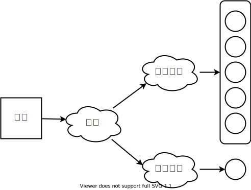

# HDF5文件结构

我们以上图6\*6的棋盘为例。棋盘可以用一个二维的6\*6的矩阵表示，空棋盘用数字0表示，黑棋棋子用1表示，白棋棋子用-1来表示。上图的输入棋盘可以表示为矩阵：

$$
\left[
 \begin{matrix}
0 & 0 & 0 & 0 & 0 & 0 \\
0 & 0 & 0 & 0 & -1 & 0 \\
0 & 0 & 1 & 0 & 0 & 0 \\
0 & 0 & 0 & 0 & 1 & 0 \\
0 & 0 & 0 & 0 & 0 & 0 \\
0 & 0 & 0 & 0 & 0 & 0
  \end{matrix}
  \right]
$$

我们借鉴著名的inception网络来构建我们的围棋智能模型。Inception是深度网络，它采用深度网络。。。。我们不打算使用像inception那么深的网络，这里我们只借鉴Inception的一组模块用于棋盘的棋形识别，然后还是和之前的感知网络一样，我们使用全连接层来做逻辑判断。为了平滑地从卷积网络过渡到感知网络，我们使最后一层卷积的输出是一个1\_1\_c的形状，然后再使用flatten功能把这层展开为感知网络。

n仅指最近的下一层节点访问的次数。由于落子的顺序不同，会存在上一层不同的棋形共享下一层的情况，因此N&lt;=n。为了辨识出共享棋形的子节点，我们用佐布里斯特散列来标识唯一的棋形，也就是节点。

alphagozero的网络在结构上和ac网络类似，差异仅仅在于学习方式上的不同

如何判定算法已经找到了最优解？我的AI程序已经训练一千万次了，没有人类选手能够击败它了，是不是意味着我的AI程序已经找到了围棋的最佳拟合函数呢？围棋本身可能并不是一款零和游戏，不过人们根据长久的围棋游戏经验，规定了在游戏结算时进行贴目，这样可以使得原本不是零和的游戏成为零和游戏。但是贴多少目才能保证游戏的公平性一直没有定论。假使有一款围棋AI已经能够以无限接近的方式拟合了围棋游戏的函数F\(x\)，通过让这款AI进行互弈，将胜利方多出的目数贴给失败方，我们就能解决贴多少目是公平的这个问题。确定AI是否已经最佳拟合了围棋的函数F\(x\)也很简单，通过反复的互弈，如果每次胜利方都是先手并且获胜的目数是固定的，那么我们就可以认为AI已经最佳拟合围棋的函数F\(x\)。所以如果现在没有一款AI程序可以做到这一点，那么围棋AI的算法就还需要改进，人类肯定已经不是挑战的目标了，现在已经变成了机器智能间的竞争。

在编写价值网络的时候，棋盘编码可以有两种，其实现难度也不同。一种是比较直观的方法，棋盘的棋形输入和落子着法分开，我们把他们看作是两件事。这种编码方式下，我们使用卷积网络提取当前棋盘局势的特征，然后再合并落子的着法，将它们输入逻辑网络进行判断，得出当前着法在当前棋局局面下的价值。另外一种方法略微抽象，我们把当前落子着法看成是棋盘的一项特征值，将其合并到已有的特征中去，形成新的一个图层，接着只需要将手工编辑好的特征输入卷积网络，我们就可以直接得到着法对应棋面的价值了。后一种方式不仅在编码实现上更简单，而且网络结构的复杂度也比前一种更低。本书对应的源码采用了前一种方法。这么做的目的是为了展示如何使用Keras来拼接网络。由于Keras的文档对这方面的介绍很少，我希望能够给读者从另外一种视角拓展对Keras在实际应用上的认识。

