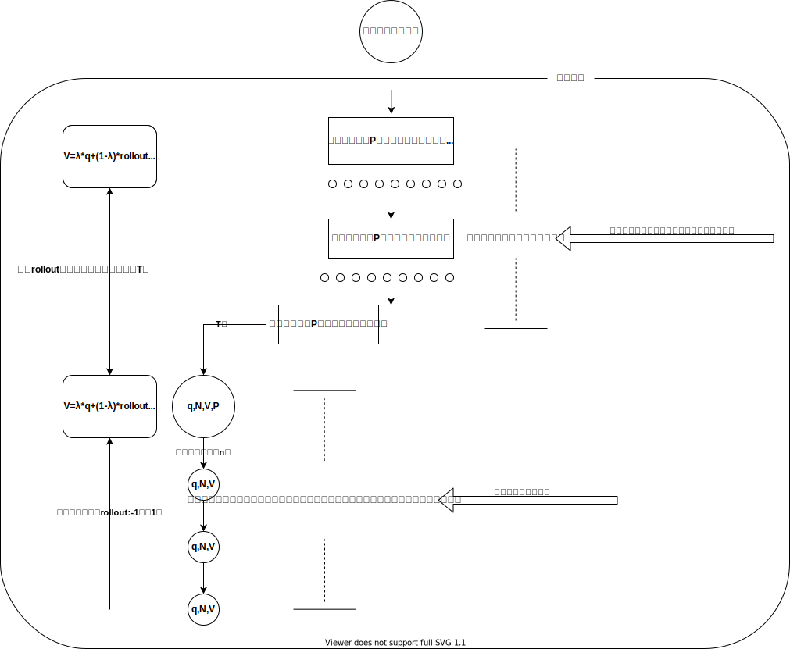

# HDF5文件结构

我们借鉴著名的inception网络来构建我们的围棋智能模型。Inception是深度网络，它采用深度网络。。。。我们不打算使用像inception那么深的网络，这里我们只借鉴Inception的一组模块用于棋盘的棋形识别，然后还是和之前的感知网络一样，我们使用全连接层来做逻辑判断。为了平滑地从卷积网络过渡到感知网络，我们使最后一层卷积的输出是一个1\_1\_c的形状，然后再使用flatten功能把这层展开为感知网络。

Alphago使用3个网络，两个策略网络，一个简单，一个复杂，复杂的用于给出可信度高的着法，简答的用于蒙特卡罗仿真，一个价值网络。我们可以使用ac网络来训练策略网络和价值网络，也可以单独训练3个网络。考虑到单独训练3个网络可以更好地利用并发机器资源，这里选择单独训练的方法。读者如果想提高训练的效率可以使用ac网络，具体的实现方法前面已经有介绍。对于网络训练方面，这一章没有更新的内容，我们基本上是复制前面介绍的梯度策略网络，价值网络或者ac网络。我们需要将注意力集中在alphago的实现方法。

对比Alphago和之前我们使用梯度策略的方式来下棋，显然从alphago的角度来看，显然仅仅用神经网络来拟合围棋是很困难的一件事情。可能我们无法找到一个合适的网络，也可能这个网络相当庞大，目前的技术能力无法在有限的时间内完成训练和学习。但是，无论怎么说，使用蒙特卡洛方法来逼近围棋函数是不得已才为之的。另外使用简单网络而不是使用复杂网络来做仿真模拟，不是因为简单网络比复杂网络运行速度快，因为运行速度这件事情可以通过并行计算解决，而且alphago每一步才仿真1600局对弈，用1600台计算机做并行计算对于谷歌来说并不是一件什么大不了的事情。使用简单网络的目的主要是为了避免仿真时由于复杂网络在策略上的傲慢，从而导致结果产生偏差。简单网络仅仅是为了避免下一些无意义的落子而已，如果计算能力足够，使用随机落子法也是可以的，但是显而易见，随机落子的效率要差一点，现在来看，alphago选择使用简单策略，应该也从侧面反应了简单策略会比随机策略要高效。说这些的目的，是为了提醒读者，没有必要对简单网络做过多的训练或者让它学习复杂的内容。另外，在用简单网络做仿真模拟时，可以以一定概率引入随机策略，目的也是为了进一步降低由于网络的局部最优特性而引起的结果偏差。

n仅指最近的下一层节点访问的次数。由于落子的顺序不同，会存在上一层不同的棋形共享下一层的情况，因此N&lt;=n。为了辨识出共享棋形的子节点，我们用佐布里斯特散列来标识唯一的棋形，也就是节点。

alphagozero的网络在结构上和ac网络类似，差异仅仅在于学习方式上的不同

如何判定算法已经找到了最优解？我的AI程序已经训练一千万次了，没有人类选手能够击败它了，是不是意味着我的AI程序已经找到了围棋的最佳拟合函数呢？围棋本身可能并不是一款零和游戏，不过人们根据长久的围棋游戏经验，规定了在游戏结算时进行贴目，这样可以使得原本不是零和的游戏成为零和游戏。但是贴多少目才能保证游戏的公平性一直没有定论。假使有一款围棋AI已经能够以无限接近的方式拟合了围棋游戏的函数F\(x\)，通过让这款AI进行互弈，将胜利方多出的目数贴给失败方，我们就能解决贴多少目是公平的这个问题。确定AI是否已经最佳拟合了围棋的函数F\(x\)也很简单，通过反复的互弈，如果每次胜利方都是先手并且获胜的目数是固定的，那么我们就可以认为AI已经最佳拟合围棋的函数F\(x\)。所以如果现在没有一款AI程序可以做到这一点，那么围棋AI的算法就还需要改进，人类肯定已经不是挑战的目标了，现在已经变成了机器智能间的竞争。

在编写价值网络的时候，棋盘编码可以有两种，其实现难度也不同。一种是比较直观的方法，棋盘的棋形输入和落子着法分开，我们把他们看作是两件事。这种编码方式下，我们使用卷积网络提取当前棋盘局势的特征，然后再合并落子的着法，将它们输入逻辑网络进行判断，得出当前着法在当前棋局局面下的价值。另外一种方法略微抽象，我们把当前落子着法看成是棋盘的一项特征值，将其合并到已有的特征中去，形成新的一个图层，接着只需要将手工编辑好的特征输入卷积网络，我们就可以直接得到着法对应棋面的价值了。后一种方式不仅在编码实现上更简单，而且网络结构的复杂度也比前一种更低。本书对应的源码采用了前一种方法。这么做的目的是为了展示如何使用Keras来拼接网络。由于Keras的文档对这方面的介绍很少，我希望能够给读者从另外一种视角拓展对Keras在实际应用上的认识。

