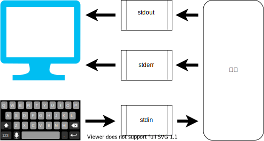
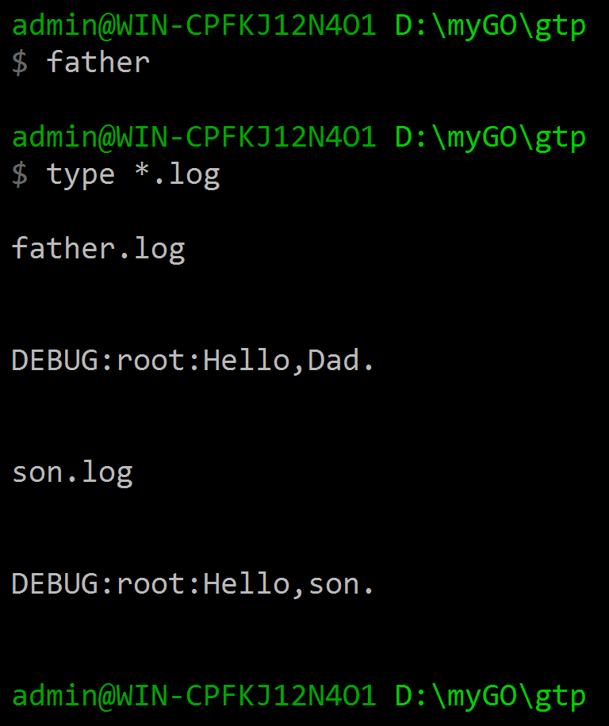
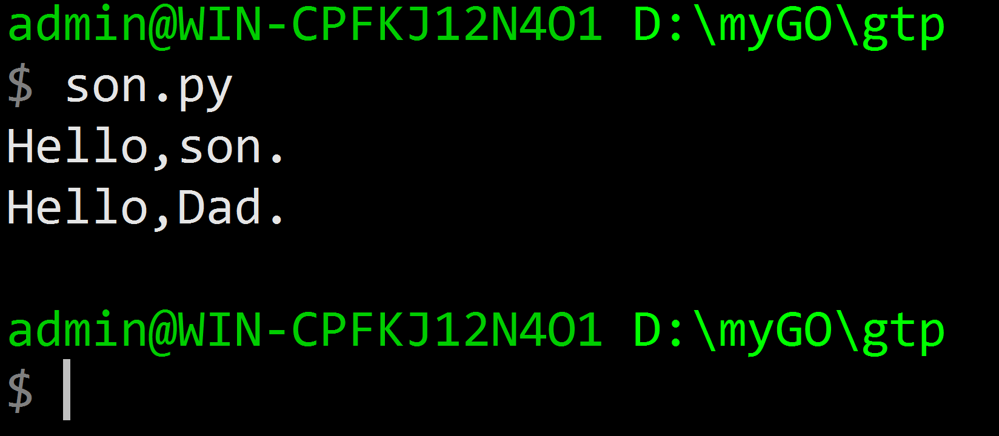
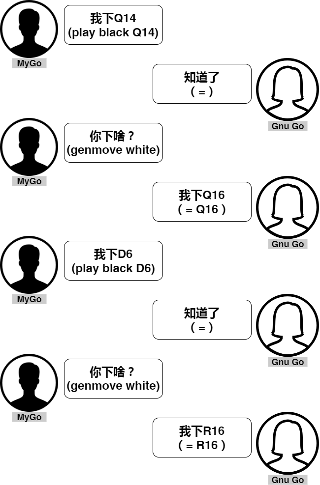
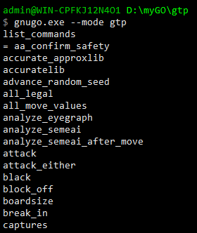
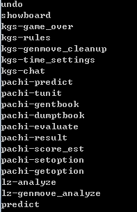

# 通用化我们的围棋AI程序

## 在网络上发布围棋AI

我们搭建一个web应用，把我们的围棋智能体发布在网络上。这样，更多的人可以通过网络来与MyGo对弈。还有一种网络对战的方式是在专业围棋对战网站上为MyGo注册一个账号，MyGo通过这个账号在战网上和玩家下棋。第二种方法可以让MyGo主动寻找对手，我们将在后面介绍。我们通过自己的网站发布是有好处的，相对于专业战网，这种方式对用户来说门槛较低，用户只需要一台可以上网的电脑打开网页就可以下棋了。Python有很多轻量的web服务器框架，Flask和Bottle是两款使用比较广泛的框架。如果用户熟悉Javascript，推荐采用Nodejs技术，使用Express框架来实现后端http服务器。这里为了保持编程语言的连贯性，我们使用Bottle来演示如何实现这样的功能。之前，我们已经实现了一个可以在本地下棋的围棋软件。我们把下围棋这件事情抽象成了三个类，棋盘，棋手和裁判。现在为了能够让用户通过网页来下棋，我们需要把棋盘和裁判这两个抽象概念搬移到网页上，在服务器后端，我们只布置棋手的功能。


由于棋盘和裁判这样东西是固定的，当用户访问我们的围棋服务器时，我们不用在后台服务器上为每个玩家实例化一整套围棋类，棋盘和裁判这两样东西就我们就交给用户的浏览器去实现。我们只需要关心棋手这个类就行了。根据围棋的特性，我们的智能体只需要知道当前局面和哪个颜色落子这两样信息就可以判断出接下去该走哪一步，所以我们只需把智能体的`chooseMove()`方法设计成一个类方法（ @classmethod ），不用每次都去实例化一个实体对象。由于需要和前端浏览器打交道，我们不得不使用Javascript在浏览器端实现棋盘和裁判的功能。幸运地是，开源网站上有许多人已经实现了这两样东西，可以拿来并稍加修改以满足我们自己个性化的需求。这里选择使用[ismyrnow的Go](https://github.com/ismyrnow/Go) 。这款前端界面的代码非常优秀，稍加修改就足够我们使用了。


由于我们的主题是如何实现围棋智能，所以这里就不多展开讨论与之无关的前端技术细节。读者如果感兴趣可以直接参考MyGo的源码。在webserver目录下可以找到server.py，它是我们的服务器应用文件，通过这个文件实现和围棋智能体的交互。


```python
from board_fast import Robot,Point    #1
@route('/genmove')
def genmove():
    color = request.query.color
    board = request.query.board
    board_array=board.split('_', -1 )    #2
    board_array=[-1 if i =='O' else i for i in board_array]    #3
    npboard=np.array(board_array)    #3
    npboard[npboard=='.'] = 0    #3
    npboard[npboard=='X'] = 1    #3
    npboard=npboard.astype(int)    #3
    npboard=np.flip(npboard.reshape(int(np.sqrt(len(npboard))),\
    int(np.sqrt(len(npboard)))).T,axis=1)    #4
    point=Robot.quickChooseMove(npboard,color=color)    #5
    return {'x':str(point.row),'y':str(point.col)}
```


1. 从之前我们编写的文件里引入机器人智能程序；
2. 前端把棋盘变成一维数组后转成字符串传到后台，字符串里用下划线作为数组元素的连接符，后台收到后需要把字符串再转会成数组；
3. 把一维数组转成numpy数组，由于传入的是字符串，需要进行一下特殊处理；
4. 把一维数组转成二维数组，变成棋盘的样子。numpy数组的圆点在左上角，而web棋盘的原点在左下角，所以需要进行坐标变换；
5. 我们的机器人根据棋局的盘面给出自己的判断。

在webserver目录下运行命令`python server.py`，打开浏览器访问[http://localhost:8080/static/frontend.htm](http://localhost:8080/static/frontend.htm)即可和MyGo对弈。为了使得MyGo能够在互联网上运行地更好，读者自己要再多做一些工作，比如使用Ngnix来处理静态文件，让Bottle只负责处理request请求。如果没有专门的服务器，读者可能需要租用一台云服务器。另外，为了方便互联网用户访问服务器，还得申请一个域名。在中国，把域名绑定到云服务提供商的服务器时还需要进行域名备案。我们鼓励熟悉前端编程的读者对界面做额外的美化工作，这样可以吸引更多的人来使用它。

## 本地对战

### 计算机的围棋语言

GMP（Go Modem Protocol）是最早用于计算机之间交流棋艺的语言。基于该协议，程序员只需要关注围棋的智能算法，无需考虑绘制棋子、缩放棋盘和其他无关的事情。这个协议是一个所有围棋程序都“应该”支持的标准。虽然这个协议历史悠久，但是目前大多数计算机围棋锦标赛使用的还是GMP协议。不过该协议在通信方面非常落后，比赛中为了实现两台计算机可以互弈，需要将两台计算机的串行通信端口以“null modem”电缆连接。

GNU Go 3.0引入了一个新协议，称为GTP协议（Go Text Protocol），其目的是建立一个比GMP协议的ascii 接口更合适于双机通信、更简单、更有效、更灵活的接口。GTP作为围棋智能体间通信方法，已为越来越多的程序采用，包括围棋引擎和围棋的图形客户端。除了可以让计算机之间相互对弈，GTP协议还有很多用途，包括回归测试开发者自己的围棋程序，对接在线围棋对弈网站，甚至是桥接围棋图形界面与在线围棋对弈网站。主流的围棋软件和在线对弈网站都支持该协议。

GTP目前有两个版本，[版本1](http://www.lysator.liu.se/~gunnar/gtp/)与[版本2](http://www.lysator.liu.se/~gunnar/gtp/gtp2-spec-draft2/gtp2-spec.html)。版本1是正式发布的围棋通信协议，但是它缺少一些围棋的个性化特色。目前被广泛支持的是GTP的版本2，但是它依然是一个草稿协议，并没有正式发布过。鉴于GTP在人民群众中的普遍性，我们为MyGo引入该协议。

我们这里介绍GTP协议中最常用的两条命令：`genmove`和`play`。其它的GTP命令可以参考官方网站上的[详细说明](https://www.gnu.org/software/gnugo/gnugo_19.html#SEC200)。我们会在后面的内容中使用到这两条命令。genmove是请求围棋软件给出当前应该下哪一步。它仅有一个参数，表示当前是请求的是哪个颜色的落子。比如`genmove B`表示请求黑棋告之落哪个子。黑色可以用大写的B或者小写的black表示，白色可以用W或者white表示。GTP协议中所有命令的应答都以等号开头，紧跟一个空格后给出当前命令的执行结果。如果命令不需要反馈结果，只需给出一个等号。play命令是告诉软件当前有什么颜色进行了落子，落在了哪里。因此play命令后有两个参数，分别表示棋子颜色和落子的位置。play命令不需要应答，程序接收后反馈等号表示接收到了命令。


### 围棋的对弈图形界面

随着围棋游戏在世界范围内的普及，Linux、Windows和苹果的Macintosh上都有开发者贡献了界面精美并且免费的围棋图形对弈软件。在Windows系统上，[Drago](http://www.godrago.net/)，[GoGui](https://sourceforge.net/projects/gogui/)和[Sabaki](https://sabaki.yichuanshen.de/)是3款人们最常用到的围棋界面软件。如果读者使用了其它操作系统，可以参考[Gnu Go](https://www.gnu.org/software/gnugo/download.html)对这些软件的介绍。

和GTP简陋的类DOS界面相比，正是有了这些精美的图形界面，使得围棋游戏可以被更多的普通人接受。

### 围棋引擎

围棋的对弈图形界面不包含智能的围棋AI程序，它们只提供基本的围棋下棋展示作用。但是主流的围棋图形界面都支持外挂围棋的智能引擎。

#### 基本原理

围棋图形界面和围棋智能程序是两个独立的程序。和许多游戏外挂软件的基本原理类似，围棋图形界面调用围棋智能程序下棋涉及到两个不同进程间的通信。进程间的通信有好多种实现方法，最常见的有管道、消息队列、信号量、共享存储、Socket、Streams等。其中管道这种方式又分成匿名管道和命名管道。采用匿名管道进行进程间通信的典型场景为父进程创建匿名管道，然后创建一批子进程继承这个匿名管道。由于是未命名的管道，匿名管道只能在本地计算机中使用，只能实现父进程和子进程之间的通信，不能实现任意两个本地进程之间的通信，不能实现跨网络之间的进程间的通信。另外，匿名管道不支持异步读、写操作，只能实现父进程和子进程之间的通信。匿名管道虽然提供的功能很单一，但是它系统开销小，结构简单，非常适合用作围棋引擎本地对战。

键盘和鼠标是我们最常见到的计算机输入设备。显示器则是常见的计算机输出设备。但是准确的说，无论是键盘也好，显示器也好，他们并不是直接和我们的程序发生数据流转的关系。外部设备和计算机直接打交道的是计算机内部称作stdin和stdout的东西，stdin的全称叫标准输入，stdout的全称是标准输出。还有一个不太常见的设备叫做stderr，全称是标准错误输出。他们是计算内数据流转的通道。stdin的作用是把输入数据传递给程序。stdout则是把程序的输出数据传递到计算机外部。stderr主要负责向计算机外部传递程序执行时发生的错误信息。对大多数人来说，stdout和stderr是一样的，因为他们都是从显示器上读到计算器向外输出的信息，但是在计算机内部，stdout和stderr则是两个完全不同的数据通道。



外部设备和计算机程序间的关系如上图所示。外部输入设备负责向stdin通道输入数据，如果程序有数据输入的需求，就从stdin通道获取数据。当程序有输出需求时，它会根据情况把数据传递给stdout或者stderr，外部设备当发现stdout或者stderr有数据时，就向外输出这些数据。由此可以发现，如果想通过A程序来控制B程序的行为，可以让A程序代替外部设备，向stdin输入数据，从stdout和stderr获取B程序的输出数据，就可以实现A程序与B程序之间的互动。

我们把围棋的图形界面程序看作A程序，将围棋智能引擎当作B程序。在计算机的世界中它们还有属于自己的专用名字，A程序称作父进程，B程序称作子进程。为了实现父进程与子进程之间信息交互，父进程首先要在程序内部调用子进程，然后申明将子进程的stdin和stdout绑定到调用子进程时创建的属于父进程的句柄上。父进程的操作对于子进程而言是透明的，它不能区分它的输入是来自用户键盘还是某一外部程序。当父进程对接了子进程的输入输出后，我们就不能再通过外部设备来输入或者接收子进程的数据，与子进程的一切交互都必须通过父进程来实现。


Python中可以使用subprocess模块来产生新的进程（子进程），它的主要功能就是执行外部的命令和程序。我们展示一个简单的示例，说明如何用subprocess的Popen函数来调用其它程序，如何创建一个匿名管道对接子程序的标准输入输出。示例中，father程序调起son程序后，向son传递消息并接收son反馈的信息，程序会把接收到的信息打印在各自的日志文件中。


```python
from subprocess import *
import logging
log_file = 'father.log'
log_level = logging.DEBUG
logging.basicConfig(filename=log_file, level=log_level)
logger = logging.getLogger()
p=Popen(["son"],shell=True,stdin=PIPE,stdout=PIPE,bufsize=0, \
        universal_newlines=True)            #1
p.stdin.write('Hello,son.\n')           #2,
line = p.stdout.readline()            #3
logger.debug(line)
```


1. 调起子进程son，为son的标准输入和输出建立起一个匿名管道。标准输入和标准输出重定向到匿名管道中。将匿名管道的stdin和stdout都设置成不缓存。Windows系统需要额外把函数的shell参数设置为True。
2. 把通信的数据设置成字节流并写入绑定标准输入的匿名管道中。传输的数据必须以换行符结束。
3. 等待从标准输出里读取子进程的输出。


```python
#!python -u            #1
import sys
import logging
log_file = 'son.log'
log_level = logging.DEBUG
logging.basicConfig(filename=log_file, level=log_level)
logger = logging.getLogger()
s=sys.stdin.readline()
logger.debug(s)
sys.stdout.write("Hello,Dad.\n")            #2
```


1. 将stdin和stdout都设置成不缓存。如果标准输入输出有缓存的话，会破坏GTP协议正常工作。stderr默认是没有缓存的。如果不显示地指明对标准输入输出设置缓存，可以在程序中使用flush\(\)函数来强制输出设备中的内容。需要特别指出，Python 2和Python 3在-u参数上的表现是不同的。Python 2会把stdin和stdout都设置成不缓存。Python 3会区别对待字节流和文本流。-u参数只能对字节流起作用，文本流不会受到这个参数的影响，所以为了使得标准输入输出的缓存为0，需要将数据强制转化为字节流。
2. Python的sys库默认以字节流进行数据传输。传输的数据以换行符结束。

执行father后，我们不需要额外输入什么其它信息，屏幕上也没有任何输出信息。



我们可以通过命令行手工执行son.py。执行后，通过键盘输入“Hello,son.”，可以从屏幕上看到程序输出“Hello,Dad.”。



对比两种不同的调用方式，可以看到他们在信息输入与输出方面的差异。和手工调用son.py相比，father程序作为父进程，完全接管了子进程的stdin和stdout，我们无法在显示器上观察到任何关于子进程的信息，也无法向子进程输入任何信息。

有些Windows围棋图形界面软件只支持载入编译成exe可执行程序的围棋引擎，有些用户可能没有安装过python，为了使我们的引擎更具普遍性，我们可以用pyinstaller程序把”.py“文件编译成exe二进制可执行文件。


#### 用pip安装pyinstaller

`pip install pyinstaller`

#### 将father.py和son.py分别编译成exe可执行文件

`pyinstaller --onefile father.py`

`pyinstaller --onefile son.py`

执行上面命令，将看到详细的生成过程。生成完成后，会在当前目录下看到多了一个 dist 目录，father.exe和son.exe 文件就在这个目录下。


大部分情况pyinstaller都可以工作的很好，但是注意，在son.py中，我们使用了`#!python -u`这个特殊编译命令，pyinstaller不能使其在exe中生效，如果要编译成exe可执行程序，需要额外加上清空缓存的命令。

```python
sys.stdout.write("Hello,Dad.\n") 
sys.stdout.flush()
```

#### MyGo对战Gnu Go

如果仅仅是完成对战，genmove和play这两条命令就足够了。Gnu Go是现成的程序，它支持GTP协议，MyGo调起Gnu Go后通过GTP协议与它通信。genmove是让Gnu Go下棋，play则是自己下棋。站在MyGo的角度，它告诉Gnu Go下了什么，然后再问Gnu Go打算下什么。



我们模仿上述father，son两个程序的运行模式，新建一个程序通过匿名通道与Gnu Go对弈。


```python
class Play_Gtp:
    def __init__(self, bot=None, handicap=0,\
        opponent=["gnugo","--mode", "gtp"],output_sgf=None,our_color='b'):    #1
        self.bot=bot
        self.dataFlow=Popen(opponent,shell=True,stdin=PIPE, \
            stdout=PIPE,bufsize=0, universal_newlines=True)    #2

    def cmd_and_resp(self,command):    #3
        self.cmd_to_op(command)
        return self.get_resp()

    def play(self):
        board=GoBoard()    #4
        whosTurn=Player.black
        player_next=whosTurn
        game_state=GameState.g_continue
        if self.bot is None:    #5
            ...
        else:
            while game_state==GameState.g_continue:
                if whosTurn == Player.black:
                    move=self.bot.chooseMove('R',board)    #6
                    board.envUpdate(whosTurn,move)
                    if move ==(-5,-5):
                        s='pass'
                    elif move ==(-10,-10):
                        s='resign'
                    else:
                        s=self.coords_to_gtp_position(move)
                    commond='play black '+s
                    print(commond)
                    self.cmd_and_resp(commond+'\n')    #7
                    [game_state,player_next]= \
                        GoJudge.NextState(whosTurn,move,board)    
                    board.envUpdate(whosTurn,move)
                else:
                    commond="genmove white"
                    resp=self.cmd_and_resp(commond+'\n')    #8
                    if resp.lower() == 'resign':
                        break
                    elif resp.lower() == 'pass':
                        move=(-5,-5)
                    else:
                        move=self.gtp_position_to_coords(resp)
                    [game_state,player_next]= \
                        GoJudge.NextState(whosTurn,move,board)    #9
                    board.envUpdate(whosTurn,move)    #10
                os.system('cls')
                board.printBoard()
                if game_state!=GameState.g_over and \
                    game_state!=GameState.g_resign:    #11
                    whosTurn=player_next
                else:
                    print("Game Over!")
```


1. 采用命令`gnugo --mode gtp`即可调用Gnu Go的GTP模式；
2. 引入之前编写的机器人；
3. 通过匿名管道传入命令后等待gnugo给出应答后才继续运行，如果不同时与多个引擎对战，采用阻塞的方式并不会影响性能；
4. 使用我们之前编写的棋盘类来记录游戏；
5. 如果不使用智能程序，我们还希望程序能够支持手工输入GTP命令，这个功能更多的是方便调试；
6. 让智能体根据当前棋局选择落子；
7. 把智能体的落子情况通知Gnu Go；
8. 请求Gno Go落子；
9. 更新当前棋局的状态记录；
10. 更新棋盘上的落子情况；
11. 如果棋局没有结束就继续。

现在我们已经具备了调用围棋引擎来下棋的能力，后面的章节中，我们会使用这个技术来生成大量的围棋对局。机器学习需要大量的样本，获取人类的对战棋局有一是数量有限，二是对局的水平参差不一。如果我们可以自己生成棋局记录，学习样本的质量和数量问题就可以得到解决。

#### 通过Sabaki让MyGo对战Gnu Go

使用MyGo调用Gnu Go来对弈就像两个人通过微信小窗聊天，通过Sabaki来调用MyGo和Gnu Go对战，更像是微信的群聊，Sabaki就是群主，通过@不同的人在MyGo和Gnu Go之间传递信息。和群聊有点区别在于MyGo和Gnu Go之间是相互看不到对方说什么的，他们之间只能通过Sabaki这个中间人来传话。


用MyGo直接调用Gnu Go对弈时，我们只需要实现两个核心GTP命令：genmove和play。但是现在，由于中间人（Sabaki）的存在，我们还需要让MyGo能听懂一些中间人的语言。我们可以通过list\_commands来查看Gnu Go、Fuego和Pachi支持哪些命令。



除了标准GTP协议以外，Gnu Go、Fuego和Pachi还会有一些自己的命令。比如Pachi会加入支持kgs在线平台的命令，也会有一些自己使用的专有命令。



和前一小章节类似，如果只是对弈，我们不必听懂中间人（Sabaki）的全部语言（GTP协议）。非常幸运，我们只需支持9个常用命令就可以通过Sabaki让MyGo和Gnu Go对弈了。


```python
class gtp_client:
    def __init__(self):
        self.commands_mini={
            "protocol_version":self.foo_protocol_version,
            "name":self.foo_name,
            "version":self.foo_version,
            "list_commands":self.foo_list_commands,
            "boardsize":self.foo_boardsize,
            "clear_board":self.foo_clear_board,
            "komi":self.foo_komi,
            "play":self.foo_play,
            "genmove":self.foo_genmove,
        }
```


除了play和genmove之外，其它命令只需要返回固定字符或者空就行了。GTP定义的命令非常简单，关于GTP命令的详细解释可以查看[GTP的说明文档](https://www.gnu.org/software/gnugo/gnugo_19.html#SEC200)。


```python
    def foo_protocol_version(self,args):         #1
        return '2'
    def foo_name(self,args):            #2
        return 'MyGO'
    def foo_version(self,args):            #3
        return '1.0'
    def foo_list_commands(self,args):            #4
        return 'protocol_version\nname\nversion\nlist_commands\n' + \
            'boardsize\nclear_board\nkomi\nplay\ngenmove'
    def foo_boardsize(self,args):            #5
        return '' if args[0] else 'board size outside engine\'s limits'
    def foo_clear_board(self,args):            #6
        return ''
    def foo_komi(self,args):            #7
        return ''
```


1. 围棋智能程序支持的版本，由于GTP 2是实际在网络上流行的围棋通信协议，MyGo也以支持这个版本为目标；
2. 围棋智能程序的名字；
3. 围棋智能程序的版本号；
4. 围棋智能程序支持的GTP命令列表；
5. 当前游戏的棋盘大小。如果只支持19路围棋的话，需要对输入的这个命令进行判断；
6. 清空棋盘；
7. 此局贴多少目。一般中国规则是6.5目。

基于前面章节我们制作的围棋程序，只需把需要的功能移植过来，就可以实现play和genmove命令的功能。


```python
class gtp_client:
    def __init__(self):            #1
        self.agentB=GoAgent(Player.black)
        self.agentW=GoAgent(Player.white)
        self.board=GoBoard()    
    def foo_play(self,args):        
        if len(args)!=2:
            return 'Unknown command.'
        if args[0].lower()!='b' and args[0].lower()!='black' \
            and args[0].lower()!='w' and args[0].lower()!='white':
            return 'Unknown command.'
        if args[0].lower()=='b' or args[0].lower()=='black':
            whosTurn=Player.black
        else:
            whosTurn=Player.white
        move=self.gtp_position_to_coords(args[1])            #2
        self.board.envUpdate(whosTurn,move)            #3
        return ''
    def foo_genmove(self,args):
        if len(args)!=1:
            return 'Unknown command.'
        if args[0].lower()=='b' or args[0].lower()=='black':
            whosTurn=Player.black
        elif args[0].lower()=='w' or args[0].lower()=='white':
            whosTurn=Player.white            
        else:
            return 'Unknown command.'
        if whosTurn==Player.black:
            move=self.agentB.chooseMove('R',self.board)            #4
        else:
            move=self.agentW.chooseMove('R',self.board)
        self.board.envUpdate(whosTurn,move)
        return self.coords_to_gtp_position(move)
```


1. 引入之前编写的GoAgent和GoBoard类作为引擎内部使用的机器人智能体和棋盘。GTP协议只传递命令信息，围棋引擎需要自己维护一份对弈棋盘的拷贝，程序使用GoBoard类的实例来维护对弈的棋盘；
2. 把人类语言描述的棋盘坐标转换成程序认识的坐标；
3. 对于play命令，只需要在棋盘里记录对方的落子即可；
4. 对于外部输入的genmove命令，我们使用智能体的chooseMove\(\)功能来对当前局面进行落子位置选择。


go\_engine\_program.py引入了我们自己编写的一些模组块，使用`pyinstaller --onefile`命令生成可执行文件的时候不会自动把这些模组一起编译进去。虽然编译时可以顺利通过，但是在执行时会报错：`no module named ’xxx'`。如果需要pyinstaller把我们自己的编写的模组一起放入可执行文件中会有点麻烦，具体的操作方式和本文的内容无关，读者可以自己查看[pyinstaller的文档](https://www.pyinstaller.org/)。我们额外提供了go\_engine\_program\_exe.py这个文件，可直接用pyinstaller编译成可执行文件。如果读者想使用围棋图形界面软件与围棋引擎对弈，可以载入go\_engine\_program\_exe.exe这个程序。


## 让我们的围棋AI自己去网上下棋

为了让我们自制的AI程序能够在网络上下棋，必须要实现全部的GTP协议，对于某些在线对弈网站可能还需要针对网站自定义的命令，实现一些功能。KGS（Kiseido Go Server）是目前网络上最活跃的围棋对弈服务器之一，每天服务器上都会聚集超过一千名全世界的围棋爱好者在上面下棋，不仅仅是人类，KGS还设有专门的电脑机器人房间，提供全球各地的围棋智能体在上面下棋。如果我们已经有了一个可以接收GTP协议的智能围棋机器人，我们就可以使用KGS提供的工具将我们的智能体接入网站，并与网站上的其他人进行围棋的较量。

KGS提供了专门的java工具[kgsGtp](http://www.gokgs.com/download.jsp)用来对接我们的围棋智能体。读者需要自己的计算机上安装java的[运行环境](http://java.com/)（）才能使用这个工具。使用kgsGtp的方法和使用围棋GUI非常类似，要做的也仅仅是提供一个可以支持GTP协议的智能体，其它的工作则交由这个工具来处理。首先我们需要在KGS上注册一个账号，KGS账号的使用是完全免费的。接着要做的就是配置一个关于智能体的配置文件，这里我展示使用Gnu Go在KGS上下棋的配置文件，用户只需要调整这个配置相关的参数，就可以使得自己的围棋智能体一样在KGS上下棋了。


```python
engine=gnugo.exe --mode gtp --quiet
name=myGnuGoBot
password=myPassword
room=Computer Go
mode=custom
reconnect=true
rules=chinese
rules.boardSize=19
rules.time=15:00+5x0:15
talk=I'm a computer.
gameNotes=Computer program GNU Go
```


读者需要一些英语单词的基础知识便可以明白上面这个配置文件的内容。还需要注意，这个配置是大小写敏感的，所以不要混用。当我们下载好kgsGtp工具后，压缩包里有一个kgsGtp.xhtml文件，这是一个kgsGtp说明书文件，用浏览器打开后读者可以了解更细节的内容，包括各种参数命令和使用场景等，我在这里就不做翻译工作了。

有了java运行环境，有了kgsGtp工具，有了能够按GTP协议运行的围棋智能体，有了KGS账号，接着只需要运行命令`java -jar kgsGtp.jar myGnuGoBot.ini`就能让我们的围棋智能体在网络上和其他人类对手或者计算机一较高下了。

如果读者觉得使用别人的工具不是很方便，或者有的人有一些特殊控制上的需求，KGS现在也提供利用json文件与服务器进行交互，读者可以自己实现一个类似kgsGtp的控制软件。KGS的json文件的传递方法和网站与用户交换json文件并没有什么区别，这部分的内容纯粹是计算机工程上的事情了，与本文无关，也就不再累述了，详细的可以参考KGS提供的[文档](http://www.gokgs.com/json/)。

互联网上还有一个专门提供给计算机之间对弈的网站叫CGOS，它和KGS的最大区别是CGOS平台只提供计算机程序之间对弈围棋，人类选手不能在上面进行围棋切磋。CGOS由于只需要提供计算机下棋的环境，因此在规则上要比KGS简单许多。CGOS的客户端软件[cgosGtp](http://www.yss-aya.com/cgos/)和kgsGtp一样，也需要一个配置文件，但是cgosGtp的配置文件要简单许多。


```python
%section server
    server yss-aya.com
    port 6809

%section player
     name      go11test
     password  secretpass
     invoke    go11.exe
     priority  7S
```


同样，关于cgosGtp更多详细的细节在软件下载包里有说明，读者可以自行下载下来研究。如果觉得cogsGtp不够灵活，可以使用Christian Nentwich提供的Python版本[cgos-client-python](http://cgos.sourceforge.net/client-python/)。

国内有很好的围棋群众基础，但是能够支持计算机AI接入的我只发现了[野狐围棋](https://www.foxwq.com/soft/aiprogramandmanual.html)这个平台。野狐围棋在接入文档上还是比较友好的，但缺点是接入前需要申请并通过审批。如果读者对国内的围棋游戏平台不满意的话，可以架设自己的公众围棋对弈服务。[OGS](https://online-go.com)是一个优秀的[开源](https://github.com/online-go)的互联网在线围棋对弈平台，它有一套完整的在线围棋对弈机制并且支持计算机智能机器人接入。

